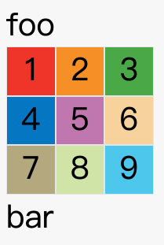

## CSS: Grid网格布局

### ✅✅✅ 一、 Flex vs Grid
- `Grid布局`与`Flex布局`有一定的相似性, 都可以指定容器内部多个项目的位置, 但是, 它们也存在重大区别
- `Flex布局`是轴线布局, 只能指定`项目`针对轴线的位置, 可以看作是`一维布局`
- `Grid`布局则是将容器划分成行和列, 产生单元格, 然后指定`项目所在`的单元格, 可以看作是二维布局.


### ✅✅✅ 二、基本概念

#### 💛💛 2.1 容器和项目
- 采购网格布局的区域, 称为`容器`(`container`). 容器内部采用网格定位的子元素, 称为`项目`(`item`)
```html
<div>
  <div><p>1</p></div>
  <div><p>2</p></div>
  <div><p>3</p></div>
</div>
```
- 上面代码中,最外层的`<div>`就是容器, 内层的三个`<div>`元素就是项目.
- 注意: `项目`只能是`容器`的`顶层`子元素, 不包含项目的子元素(`<p>`元素就不是项目). `Grid布局`只针对项目生效

#### 💛💛 2.2 行和列
- 容器里面的水平区域称之为`行`(`row`), 垂直区域称之为`列`(`column`), 下图中, 水平的深色区域就是`行`, 垂直的深色区域就是`列`


#### 💛💛2.3 单元格
- 行和列交叉的区域, 称之为`单元格`(`cell`)
- 正常情况下, `n`行和`m`列 会产生`m * n` 个单元格: 3行3列产生9个单元格

#### 💛💛 2.4 网格线
- 划分网格的线, 称为`网格线`(`grid line`). 水平网络线划分出行, 垂直网格线划分出列
- 正常情况下, `n`行会有`n+1`根水平网格线; `m`列会有`m+1`根垂直网格线: 比如三行有四根水平网格线
- 下图是一个 4 x 4 的网格,共有5根水平网格线和5根垂直网格线.


### ✅✅✅ 三、容器属性
- Grid 布局的属性分成两类, 一类定义在容器上面 => `容器属性`, 一类定义在项目上面 => `项目属性`.

#### 💛💛 3.1 display 属性
- `display: grid`: 指定一个容器采用网格布局
```css
  div {
    display: grid;
  }
```
- 请参考 `css/grid-1.html`
```css
  span {
      font-size: 2em;
  }
  #container {
      display: grid;
      grid-template-columns: 50px 50px 50px;
      grid-template-rows: 50px 50px 50px;
  }
  .item {
      font-size: 2em;
      text-align: center;
      border: 1px solid #e5e4e9;
  }
  .item-1 {
      background-color: #ef342a;
  }
  .item-2 {
      background-color: #f68f26;
  }
  .item-3 {
      background-color: #4ba946;
  }
  .item-4 {
      background-color: #0376c2;
  }
  .item-5 {
      background-color: #c077af;
  }
  .item-6 {
      background-color: #f8d29d;
  }
  .item-7 {
      background-color: #b5a87f;
  }
  .item-8 {
      background-color: #d0e4a9;
  }
  .item-9 {
      background-color: #4dc7ec;
  }
```
```html
<body>
    <span>Top Part</span>
    <div id="container">
        <div class="item item-1">1</div>
        <div class="item item-2">2</div>
        <div class="item item-3">3</div>
        <div class="item item-4">4</div>
        <div class="item item-5">5</div>
        <div class="item item-6">6</div>
        <div class="item item-7">7</div>
        <div class="item item-8">8</div>
        <div class="item item-9">9</div>
    </div>
    <span>Bottom Part</span>
</body>
```


- 默认情况下, `容器元素`都是`块级`元素, 但也可以修改成行内元素
```css
  div {
    display: inline-grid;
  }
```


- 注意: 样式设置为`grid`后, 容器子元素(`项目`)的`float`,`display:inline-block`,`display:table-cell`,`vertical-align`和`column-*`等设置都将失效.

#### 💛💛 3.2 grid-template-columns 和 grid-template-rows 属性
- 容器指定了网格布局以后, 就要划分行和列, 
- 1. `grid-template-columns` 属性定义每一列的列宽
- 2. `grid-template-rows` 属性定义每一行的行高
```css
  .container{
    display: grid;
    grid-template-columns: 100px 100px 100px;
    grid-template-rows: 100px 100px 100px;
  }
```
- 上面的代码指定了一个三行三列的网格, 列宽和行高都是 `100px`
- 除了使用绝对单位, 还可以使用百分比
```css
  .container {
    display: grid;
    grid-template-columns: 33.33% 33.33% 33.33%;
    grid-template-rows: 33.33% 33.33% 33.33%;
  }
```

#### 🚀 3.2.1 repeat()
- 重复写同样的值非常麻烦, 尤其是网格很多时, 这时, 可以使用`repeat()`函数, 简化重复的值, 上面的代码用`repeat()`改写如下:
```css
  .container {
    display: grid;
    grid-template-columns: repeat(3, 33.33%);
    grid-template-rows: repeat(3, 33.33%);
  }
```
- `repeat()`接受两个参数: 第一个参数时重复的次数(上例的`3`), 第二个参数是所要重复的值
- `repeat()`重复某种模式也是可以的
```css
  .container {
    display: grid;
    grid-template-columns: repeat(2, 100px 20px 80px);
    /* 上面代码定义了6列, 第1/4的宽度为100px; 第2/5的宽度为20px; 第3/6列的值为80px */
  }
```

#### 🚀 3.2.2 auto-fill属性
- 有时候, 单元格的大小是固定的, 但是容器的大小是不确定的, 如果希望每一行(或者每一列)容纳尽可能多的单元格, 这时候可以使用`auto-fill`关键字来表示自动填充
```css
  .container{
    display: grid;
    grid-template-columns: repeat(auto-fill, 100px);
    /* 表示每列列宽100px, 自动填充,直到容器不能放置更多的列 */
  }
```

#### 🚀 3.2.3 fr 关键字
- 为了方便表示比例关系, 网格布局提供了`fr`关键字 => `fraction`片段.
- 如果两列的宽度分别为`1fr`和`2fr`, 表示前者是后者的两倍
```css
  .container{
    display: grid;
    grid-template-columns: 1fr 2fr 1fr;  /* 3列: 宽度比例 1:2:1 */
    grid-template-columns: 1fr 1fr;  /* 2列: 宽度比例 1:1 */
  }
```
- `fr`可以与绝对长度结合使用
```css
  .container{
    display: grid;
    grid-template-columns: 150px 1fr 2fr; /* 3列: 第1列的宽度是150px; 第2列的宽度是第3列的一半 */
  }
```

#### 🚀 3.2.4 minmax()
- `minmax()`函数产生一个长度范围, 表示长度就在这个范围中, 它接受两个参数, 分别为最小值和最大值
```css
  .container{
    display: grid;
    grid-template-columns: 1fr 1fr minmax(100 1fx); /* 第3列的列宽不小于100px 不大于 1fr */
  }
```

#### 🚀 3.2.5 auto 关键字
- `auto`关键字由浏览器自己决定长度
```css
  .container{
    display: grid;
    grid-template-columns: 100px auto 100px; /* 第3列的列宽不小于100px 不大于 1fr */
  }
```

#### 🚀 3.2.6 网格线的名称
- `grid-template-columns`和`grid-template-rows`的属性里面, 还可以使用方括号指定每一个网格线的名字, 方便以后的引用
```css
  .container{
    display: grid;
    grid-template-columns: [c1] 100px [c2] 100px [c3] auto [c4];
    grid-template-rows: [r1] 100px [r2] 100px [r3] auto [r4];
    /* 3 * 3的布局, 因此有4根垂直网格线和4根水平网格线, 方格中依次是这八根线的名字 */
  }
```
- 网格线允许同一根线有多个名字 [fifth-line row-5]

#### 🚀 3.2.7 布局实例
- `grid-template-columns`属性对于网页布局非常有用, 两栏式布局只要一行代码
```css
  .wrapper{
    display: grid;
    grid-template-columns: 70% 30%; /* 左边-70%, 右边-30% */
  }
```
- 对于传统的12个栅栏布局
```css
  .row{
    display: grid;
    grid-template-columns: repeat(12, 1fr);
  }
```

#### 💛💛 3.3 grid-row-gap grid-column-gap grid-gap 属性
- `grid-row-gap`: 设置行间距
- `grid-column-gap`: 设置列间距
```css
  .container{
    grid-row-gap: 20px;
    grid-column-gap: 20px;
  }
```
- `grid-gap`: 是 `grid-row-gap` 和 `grid-column-gap` 的简写
- 如果`grid-gap` 省略了第二个值, 浏览器认为第二个值等于第一个值
- 根据最新`W3C`标准,上面3个属性名的`grid-`前缀已经删除, `grid-column-gap`=>`column-gap`, `grid-row-gap`=>`row-gap`, `grid-gap`=>`gap`

#### 💛💛 3.4 grid-template-areas 属性
- 网格布局允许指定区域`area`, 一个区域由单个或多个单元格组成. `grid-template-areas`属性用于定义区域.
```css
  .container{
    display: grid;
    grid-template-columns: 100px 100px 100px;
    grid-template-rows: 100px 100px 100px;
    grid-template-areas: 'a b c'
                         'd e f'
                         'g h i'; 
                         /* 上面代码先划分出来9个单元格, 然后将其定名为 a 到 i 的9个区域, 分别对应着9个单元格 */
  }
```
- 多个单元格合并成一个区域的写法如下:
```css
    .container{
      display: grid;
      grid-template-columns: 100px 100px 100px;
      grid-template-rows: 100px 100px 100px;
      grid-template-areas: 'a a a'
                           'b b b'
                           'c c c'; 
    }
```
- 下面是一个布局实例
```css
    .container{
      display: grid;
      grid-template-columns: 100px 100px 100px;
      grid-template-rows: 100px 100px 100px;
      grid-template-areas: 'header header header'
                           'main main sidebar'
                           'footer footer footer'; 
  }
```
- 上面代码中, 顶部是页眉区域 `header`, 底部是页脚区域 `footer`, 中间部分则为 `main` 和 `sidebar`
- 如果某些区域不需要利用, 则使用"点"(.)表示
```css
    .container{
      display: grid;
      grid-template-columns: 100px 100px 100px;
      grid-template-rows: 100px 100px 100px;
      grid-template-areas: 'header . header'
                           'main . sidebar'
                           'footer . footer'; 
  }
```

#### 💛💛 3.5 grid-auto-flow 属性
- 划分网格后, 容器的子元素会按照顺序, 自动放置在每一个网格. 默认的放置顺序是`先行后列`, 即先填满第一行, 然后再放入第二行


- 这个顺序由`grid-auto-flow`来决定, 默认是`row`: `先行后列`, 如果将其改成`column`变成`先列后行`


- `grid-auto-flow`: 除了设置`row`和`column`, 还可以设置成`row dense`和`column dense` 这2个值主要用于 某些指定项目指定位置以后, 剩下的项目怎么自动放置
- `/css/grid-auto-flow-1.html`中的效果


- 上图中1号项目后面的位置是空的, 是因为3号项目默认跟着2号项目, 所以排在2号项目后面
- 现在修改为`grid-auto-flow: row dense`: 表示先行后列, 尽可能填满, 尽量不出现空格


- 上图会先填满第一行, 再填满第二行, 所以3号项目就会紧跟在1号项目的后面.8号项目和9号项目就会排到第四行.
 
- 如果将设置改为 `column dense`, 表示"先列后行", 并且尽量填满空格.


