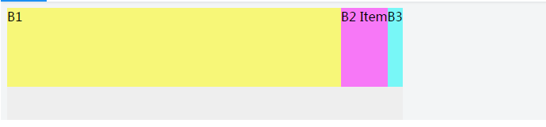

### CSS: flex 不是 display:flex
- `flex` 布局发生在父容器和子容器之间,父容器需要有 `flex` 的环境(`display:flex;`), 子容器才能根据自身的属性来布局,简单的说, 就是瓜分父容器的空间.相反就是说如果父容器没有flex的环境, 那么子容器就无法使用flex的规则来划分父容器的空间
- 这里说的不是 `display:flex`, 而是处于`display:flex`布局下的项目
- 讲到瓜分父容器的空间,那么首先需要讲一个很重要的词: `剩余空间`
- 参考demo: `css\flex-1.html`


### 💛 剩余空间
- 具备flex环境的父容器, 通常是有一条主轴和一条侧轴, 默认情况下主轴就是水平从左向右的,侧轴是垂直从上到下的,剩余空间就是父容器在主轴的方向上还有多少可用的空间
```html
    <div class="container">
        <span class="B1"></span>
        <span class="B2"></span>
        <span class="B3"></span>
    </div>
```
- `container` 就是父容器, B1 B2 B3就是子容器, 假如container的width是500px, 那么剩余空间就是：500px - B1.width - B2.width - B3.width.嗯就是这么简单!

### 💛 flex-grow: 默认值 0
- 知道了剩余空间, 假设container的width是500px, 现在我们再假设B1、B2、B3的width是100px,那么剩余空间就是500-100*3=200px. 知道了剩余空间有什么用呢,这个时候flex-grow就该出场了,假如我们这个时候对B1设置flex-grow:1,B1把B2和B3都挤到右边了, 也就是说剩余的200px空间都被B1占据了, 所以此时B1的width比实际设置的值要大


- 所以这里flex-grow的意思已经很明显了, 就是索取父容器的剩余空间,默认值是0, 就是三个子容器都不索取剩余空间.但是当B1设置为1的时候, 剩余空间就会被分成一份, 然后都给了B1,如果此时B2设置了flex-grow:2, 那么说明B2也参与到瓜分剩余空间中来, 并且他是占据了剩余空间中的2份, 那么此时父容器就会把剩余空间分为3份, 然后1份给到B1, 2份给到B2


### 💛 flex-basis: 默认值 auto
- 这个属性值的作用也就是width的替代品, 如果子容器设置了flex-basis或者width, 那么在分配空间之前, 他们会先跟父容器预约这么多的空间, 然后剩下的才是归入到剩余空间, 然后父容器再把剩余空间分配给设置了flex-grow的容器, 如果同时设置flex-basis和width, 那么width属性会被覆盖, 也就是说flex-basis的优先级比width高.有一点需要注意, 如果flex-basis和width其中有一个是auto, 那么另外一个非auto的属性优先级会更高.
- tips:flex-basis和width为auto值, 那最后的空间就是根据内容多少来定的, 内容多占据的水平空间就多.




### 💛 flex-shrink : 默认值 1
- 上面讲的都是剩余空间的分配, 可以发现, 上面讲的例子B1 B2 B3的宽度总和都是没有超过父容器的宽度的, 那如果三个子容器的宽度和超过父容器的宽度呢, 那还有剩余空间可以分配吗, 此时浏览器又是怎么处理呢? 请看下面：
- tips：flex环境默认是不换行的, 即使父容器宽度不够也不会, 除非设置flex-wrap来换行


- 此时我们会发现, B1设置的flex-grow没有作用, 不但没有获取到剩余空间, 他的空间甚至是比他定义的300px还要小, 而且我们发现B2和B3的空间也相应的被压缩了. 那么这里的问题就是：
- 1. 为什么flex-grow没有作用, 反而被压缩呢? 
- 2. 三个容器的压缩比例是这样的呢? 
- 这就是 flex-shrink 的作用了.
- 同样的, 三个容器处于flex环境中, 所以布局之前, 父容器还是会计算剩余空间. 这一次计算的结果是这样的：剩余空间＝500px - 300px - 160px - 120px = -80px, 剩余空间是一个负数所以很容易理解第一个问题, 即使是设置了flex-grow, 但是由于没有剩余空间, 所以B1分配到的空间是0.
- 由于flex环境的父容器的宽度500px是不会变, 所以为了是子容器的宽度和最多为父容器的宽度, 那就只有两个办法：第一个是使子容器换行, 第二个是压缩子容器使之刚好撑满父容器的宽度.  因为flex子容器是默认不换行的, 所以这里不做讨论
- 而第二种压缩, 实际上就是上面例子表现出来的样式. 现在就遇到了上面第二个问题, 这三个的压缩比例是多少呢, 各自需要压缩的空间是多少呢?
- 这个时候就需要谈谈flex-shrink, 这个属性其实就是定义一个子容器的压缩比例. 他的默认值是1, 所以上面那个例子, 就是三个子容器压缩的比例是一样的 1:1:1.  如果此时我们设置B1的压缩比例是2, 那会怎样呢？


- 我们可以发现, B1被压缩的更多了. 而B2和B3得到了跟多的空间. 那我们怎么得出他们各自的压缩率呢？我们假设B2 B3的压缩率是X1, 那么B1的压缩率就是X2了, 那就有了如下方程：

### 总结
1. 剩余空间＝父容器空间－子容器1.flex-basis/width - 子容器2.flex-basis/width - 
2. 如果父容器空间不够, 就走压缩flex-shrink, 否则走扩张flex-grow
3. 如果你不希望某个容器在任何时候都不被压缩, 那设置flex-shrink:0
4. 如果子容器的的flex-basis设置为0(width也可以, 不过flex-basis更符合语义), 那么计算剩余空间的时候将不会为子容器预留空间.
5. 如果子容器的的flex-basis设置为auto(width也可以, 不过flex-basis更符合语义), 那么计算剩余空间的时候将会根据子容器内容的多少来预留空间

### 默认值
- flex: `flex-grow`,`flex-shrink`和`flex-basis`属性的缩写
- 默认值: `0 1 auto`

### 不同浏览器前缀
- `-webkit-`
- `-ms-`
- `-moz`
- `-o-`