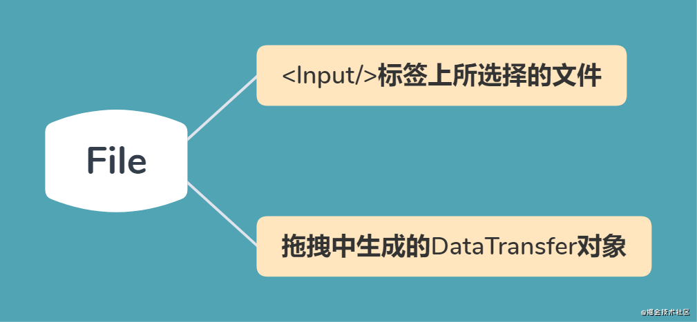
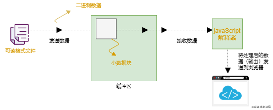
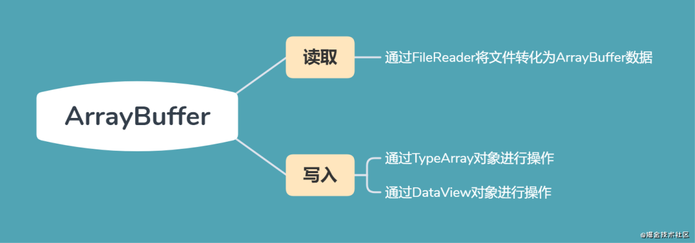
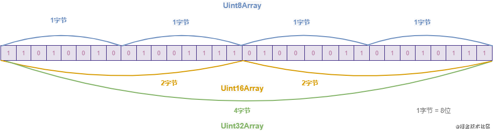
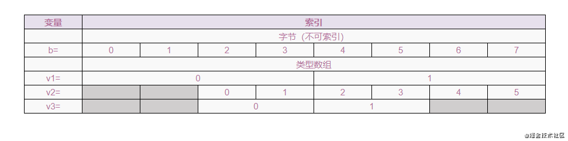
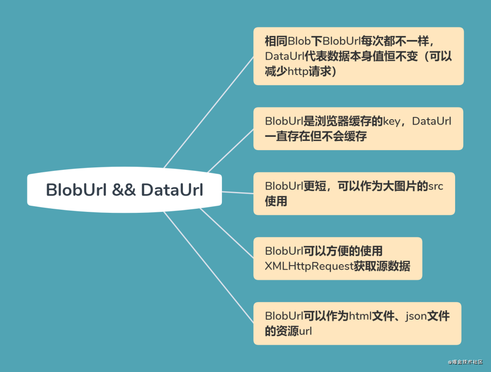
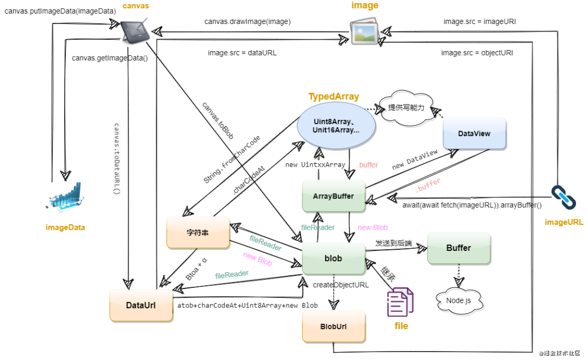

# ✅ Blob

##  Blob 概念 
- `Blob`: 表示二进制类型的大对象, 通常是影像, 声音或多媒体文件, 在`JavaScript`中`Blob`表示一个不可变,原始数据的类文件对象.
- 构造函数如下:
```js
new Blob(blobParts, options)
```
- `blobParts`: 数组类型, 可以存放任意多个 _`ArrayBuffer`_, _`ArrayBufferView`_, _`Blob`_ 或者 _`DOMString`_(编码为UTF-8), 将它们链接起来构成`Blob`对象的数据
- `options`: 可选项, 用于设置`blob`对象的属性, 可以指定如下两个属性
- - `type`: 存放到`blob`中数组内容的 _`MIME`_ 类型, 默认为 `""`
- - `endings`: 用于指定包含行结束符`\n`的字符串如何被写入. 值为 _`native`_ 表示行结束符会被更改为适合宿主操作系统文件系统的换行符(默认值为 _`transparent`_ 表示会保持`blob`中保存的结束符不变).

```bash
# DOMString 是一个 UTF-16 字符串. 由于JavaScript已经使用了这样的字符串, 所以DOMString直接映射到一个String
```

```bash
# ArrayBuffer(二进制数据缓冲区), ArrayBufferView(二进制数据缓冲区的 array-like 视图)
```

### 🏀 示例如下
1. 创建一个包含 `domString`对象的`blob`对象
```js
const blob = new Blob(['<div>john</div>'], { type: 'text/xml' })
/**
 * Blob {size: 15, type: "text/xml"}
 */
```

2. 创建一个包含 `ArrayBuffer`对象的`blob`对象
```js
// 浏览器环境中运行
var arraybuffer = new ArrayBuffer(10)
console.info('arraybuffer', arraybuffer)
/**
 *  [[Int8Array]]: Int8Array(10) [0, 0, 0, 0, 0, 0, 0, 0, 0, 0]
    [[Int16Array]]: Int16Array(5) [0, 0, 0, 0, 0]
    [[Uint8Array]]: Uint8Array(10) [0, 0, 0, 0, 0, 0, 0, 0, 0, 0]
    byteLength: 10
 */
const blob = new Blob([arraybuffer], { type: 'text/plain' })
console.info('blob', blob)
/**
 *   Blob {size: 10, type: "text/plain"}
 */
```

3. 创建一个包含 `ArrayBufferView`对象的`blob`对象
```js
var arraybuffer = new ArrayBuffer(8)
var arraybufferview = new Int16Array(arraybuffer)
console.info('arraybufferview', arraybufferview)
/**
 * Int16Array(4) [ 0, 0, 0, 0 ]
 */
const blob = new Blob([arraybufferview], { type: 'text/plain' })
console.info('blob', blob)
/**
 *  Blob {size: 4, type: "text/plain"}
 */
```

### 🍉 Blob 属性
- `Blob`对象有两个属性
- `MIME (Multipurpose Internet Mail Extensions)` 是描述消息内容类型的因特网标准.

| 属性名 | 描述 |
| ---- | ---- |
| size  | Blob 对象中所包含数据的大小,单位为字节.只读. |
| type  | 一个字符串, 表明该Blob对象所包含数据的MIME数据类型. 如果类型未知,则该值为空字符串.只读. |

### 🍉 Blob 方法
- 🚕`slice(start:number, end:number, contentType: DOMString)`: 类似于数组的 _`slice`_方法,将原始的`Blob`对象按照指定范围分割成新的`blob`对象并返回,可以用作切片上传
- - `start`: 开始索引, 默认为0
- - `end`: 结束索引, 默认为最后一个索引
- - `contentType`: 新`Blob`的`MIME`类型,默认情况下为空字符串.
- 🚕 `stream()`: 返回一个能读取`blob`内容的 _`ReadableStream`_
- 🚕 `text()`: 返回一个 _`Promise`_ 对象 且包含`blob`所有内容的`UTF-8`格式的 _`USVString`_
- 🚕 `arrayBuffer()`: 返回一个 _`Promise`_ 对象且包含`blob`所有内容的`二进制`的 _`ArrayBuffer`_

- 将`blob`(或者`file`)二进制文件保存到`formData`进行网络请求(之后可以获取到图片的`imageUrl`可以用作图片展示或者后续的通过`websocket`发送图片地址)

# ✅ File
- `File`对象是一种特殊的`Blob`对象, 继承了所有`Blob`的属性和方法, 当然同样也可以用作`formData`二进制文件上传.



- 下面我们分别使用input和拖放方式选择多张图片操作👇:
- 
### 🏀 input获取本地文件
- 为`input`元素添加`multiple`属性, 允许用户选择多个文件, 用户选择的每一个文件都是一个`file`对象, 而`FileList`对象则是这些`file`对象的列表, 代表用户选择的所有文件, 是`file`对象的集合.
```html
<body>
    <input type="file" id="f" />
    <script>
        var elem = document.getElementById('f')
        elem.onchange = function (event) {
            var files = event.target.files
            var file = files[0]
            console.info('files', files)  // [{{name: "1.jpg",lastModified: 1594369580771...},{name:'2.jpg',lastModified: 1596012406708...}]
            console.info('file', file)  // {name: "1.jpg",lastModified: 1594369580771,size: 22344,type: "image/jpeg"...}
            console.info(file instanceof File) // true
            console.info(files instanceof FileList)

            // File 继承 Blob
            console.info(file.__proto__.__proto__) // 参考图片 file_extends_blob.png
        }
    </script>
</body>
```

### 🏀 拖放获取本地文件
```html
<body>
    <div ondrop="drop(event);" ondragover="allowDrop(event);" id="content"></div>
    <script>
        function allowDrop(ev) {
            ev.preventDefault()
        }
        function drop(ev) {
            ev.preventDefault()
            const files = ev.dataTransfer.files
            console.info('files', files)
            /*
             0: File {name: "1-2-arraybuffer-to-blob.js", lastModified: 1611728894565, lastModifiedDate: Wed Jan 27 2021 14:28:14 GMT+0800 (中国标准时间), webkitRelativePath: "", size: 467, …}
             1: File {name: "1-3-arraybufferview-to-blob.js", lastModified: 1611729150973, lastModifiedDate: Wed Jan 27 2021 14:32:30 GMT+0800 (中国标准时间), webkitRelativePath: "", size: 358, …}
            */
            console.info('files', files instanceof FileList) // true
        }
    </script>
</body>
```


### 🍉 File 属性
| 属性名 | 描述 |
| ---- | ---- |
| lastModified  | 引用文件最后修改日期. |
| name  | 文件名或文件路径. |
| size  | 以字节为单位返回文件的大小. |
| type  | 文件的MIME类型. |

### 🍉 File 方法
- `File` 对象没有自己的实例方法, 由于继承了 `Blob`对象, 因此可以使用`Blob`的实例方法`slice()`


# ✅ 数据缓冲区
- 从`XHR`,`File API`,`Canvas`等各种地方, 读取了一大串字节流, 如果用`JS`里的`Array`去存, 又浪费, 又低效. 在编程中, `数据缓冲区`(或简称为缓冲区) 是物理内存中操作二进制数据的存储区(比硬盘驱动器访问快),用于在数据从也给位置移动到另一位置时存储临时数据. `解释器`借助存储二进制数据的内容缓冲区读取行. 主内存中又一个正在运行的文件, 如果解释器必须返回文件以读取每个`字节`, 则执行过程将耗费大量时间. 为了防止这种情况, JavaScript使用数据缓冲区, 该缓冲区将一些`字节`存储在一起, 然后将所有`字节`一起发送给解释器. 这样, JavaScript解释就不必担心从文件数据中检索文件. 这种方法节省了执行时间并加快了应用程序的速度. 各种缓冲区能对数据执行有效的二进制操作. 包括`File`, `Blob`,`ArrayBuffer`和`Array`. 选择的方法决定了内存缓冲区的内部结构.



# ✅ Buffer
- `Buffer`是`Node.js`的对象,前端没有. 它一般应用于`IO操作`, 例如接收前端请求数据的时候, 可以通过`Buffer`相关的`API`创建一个专门存放二进制数据的缓存区对接收到的前端数据进行整合, 一个`Buffer`类似于一个整数数组, 它对于`V8`堆内存之外的一块原始内存

# ✅ ArrayBuffer
- `ArrayBuffer`表示固定长度的二进制数据的原始缓冲区, 它的作用是分批一段可以存放数据的连续内存区域. 因此对于高密度的访问（如音频数据）操作而言它比JS中的Array速度会快很多,ArrayBuffer存在的意义就是作为数据源提前写入在内存中,因此其长度固定.
- `ArrayBuffer`的功能



- `ArrayBuffer` 对象的构造函数如下(length表示`ArrayBuffer`的长度)👇:
```js
ArrayBuffer(length)
```

- `Array` 和 `ArrayBuffer` 的区别👇:

| Array | ArrayBuffer |
| ---- | ---- |
| 可以放数字、字符串、布尔值以及对象和数组等| 只能存放0和1组成的二进制数据. |
| 数据放在堆中| 数据放在栈中, 取数据时更快. |
| 可以自由增减| 只读, 初始化后固定大小, 无论缓冲区是否为空, 只能借助TypedArrays、Dataview写入. |

### 🍉 ArrayBuffer对象属性
| 属性名 | 描述 |
| ---- | ---- |
| byteLength  | 表示ArrayBuffer的大小. |

### 🍉 ArrayBuffer 方法
- `slice()`: 有2个参数 _`begin`_ 表示起始, _`end`_ 表示 结束点. 方法返回一个新的`ArrayBuffer`, 它的内容是这个`ArrayBuffer`的字节副本. 从`beigin`(包括),到`end`(不包括)
- `ArrayBuffer`不能直接操作,而是要通过`TypedArray`和`DataView`对象来操作, 它们会将缓冲区中的数据转换为各种数据类型的数组,并通过这些格式来读取缓冲区的内容.


# ✅ ArrayBufferView
- 由于`ArrayBuffer`对象不提供任何直接读取内存的方法, 而`ArrayBufferView`对象实际上是建立在`ArrayBuffer`对象基础上的视图, 它指定了`原始二进制数据`的基本处理单元, 通过`ArrayBufferView`对象来读取`ArrayBuffer`对象的内容. 类型化数组`TypedArrays`和`DataView`是`ArrayBufferView`的实例

### 🍉 ArrayBufferView 之 TypedArrays
- 类型化数组`TypedArrays`是JavaScript中新出现的一个概念, 专门为访问原始二进制数据而生, 本质上, 类型化数组和`ArrayBuffer`是一样的, 只不过它具备读写功能. 类型数组的类型有:

| 名称 | 大小 (以字节为单位) | 说明 |
| ---- | ---- | ---- |
| Int8Array  | 1 | 8位有符号整数 |
| Uint8Array | 1 | 8位无符号整数 |
| Int16Array | 2 | 16位有符号整数 |
| Uint16Array| 2 | 16位无符号整数 |
| Int32Array | 4 | 32位有符号整数 |
| Uint32Array| 4 | 32位无符号整数 |
| Float32Array | 4 | 32位浮点数 |
| Float64Array | 8 | 64位浮点数 |

- 类型转换如图👇:



- 举一些代码例子展示如何转换:
```js
// 创建一个 8 字节的 ArrayBuffer
var b = new ArrayBuffer(8)
console.info('b', b)

// 创建一个指向 b 的视图 v1, 采用 Int32类型, 开始于默认的字节索引0, 直到缓冲区的末尾
var v1 = new Int32Array(b) // v1: Int32Array(2) [0,0]

v1[0] = 1 // v1: Int32Array(2) [1, 0]

// 创建一个指向 b 的视图 v2, 采用Uint8类型, 开始于字节索引2, 直到缓冲区的末尾
var v2 = new Uint8Array(b, 2) // // Uint8Array(6) [0, 0, 0, 0, 0, 0]
console.info('v2', v2)

// 创建一个指向b的视图v3, 采用Int16类型, 开始于字节索引2, 长度为2
var v3 = new Int16Array(b, 2, 2) // Int16Array(2) [0, 0]

```


- 因为普通 `Javascript` 数组使用的是`Hash`查找方式, 而类型化数组直接访问固定内存, 因此, 速度很赞, 比传统数组要快! 同时, 类型化数组天生处理二进制数据, 这对于 `XMLHttpRequest`, `canvas`, `webGL` 等技术有着先天的优势.

```bash
    # TypedArray 的应用如何拼接两个音频文件
    fetch 请求音频资源 -> ArrayBuffer -> TypedArray -> 拼接成一个TypedArray -> ArrayBuffer -> Blob -> ObjectUrl
```

### 🍉 ArrayBufferView 之 DataView
- `DataView`对象可以在`ArrayBuffer`中的任意位置读取和存储不同类型的二进制数据
```js
var dataView = new DataView(DataView(buffer, byteOffset[可选], byteLength[可选]);
```

### 🍉 DataView 属性
- `DataView`对象有3个属性

| 属性名 | 	描述 | 
| ---- | ---- |
| buffer | 表示ArrayBuffer | 
| byteOffset | 指缓冲区开始处的偏移量 | 
| byteLength | 指缓冲区部分的长度 | 

### 🍉 DataView 方法
- `setint8()`: 从 _`DataView`_ 起始位置以`byte`为计数的指定偏移量(`byteOffset`)处存储一个`8-bit`数(一个字节)
- `getint8()`: 从 _`DataView`_ 起始位置以`byte`为计数的指定偏移量(`byteOffset`)处获取一个`8-bit`数(一个字节)
- 除此之外还有 `getInt16`, `getUint16`, `getInt32`, `getUint32`... 使用方法一致,这里就不一一例举.
```js
let buffer = new ArrayBuffer(32)
let dv = new DataView(buffer, 0)
dv.setInt16(1,56)
dv.getInt16(1) // 56
```

# ✅ FileReader
- 我们无法直接访问`Blob`或者文件对象的内容, 如果想要读取它们并转化为其他格式的数据, 可以借助`FileReader`对象的`API`进行操作.
- `readAsText(Blob)`: 将 `Blob`转化为文本字符串
- `readAsArrayBuffer(Blob)`: 将 `Blob` 转为 `ArrayBuffer` 格式数据
- `readAsDataURL(Blob)`: 将`Blob` 转为 `Base64`格式的 `DataURL`
```js
var blob = new Blob(['<xml>foo</xml>'], { type: 'text/xml' })
console.info(blob) // Blob(14) {size: 14, type: "text/xml"}

var reader = new FileReader()
reader.onload = () => {
  console.info(reader.result)
}

reader.readAsText(blob) // <xml>foo</xml>
reader.readAsArrayBuffer(blob) // ArrayBuffer(14) {}
reader.readAsDataURL(blob) // data:text/xml;base64,PHhtbD5mb288L3htbD4=
```

```html
<body>
    <input type="file" id='f' />
    <script>
        var f = document.getElementById('f')
        function onChange(event) {
            var files = event.target.files
            var file = files[0]

            // 首先需要创建一个FileReader的实例
            const reader = new FileReader()
            reader.onload = function () {
                // 加载完成时执行回调
                const content = reader.result
                console.info('content', content)
            }
            reader.readAsText(file)
        }
        f.addEventListener('change', onChange, false)
    </script>
</body>
```

# ✅ BlobURL
- `BlobURL` (`ObjectURL`) 是一种伪协议, 只能由浏览器在内部生成, 我们知道 `script/img/video/iframe` 等标签的 `src` 属性 和 `background` 的 `url` 可以通过 `url` 和 `base64` 来显示
- 我们同样可以把 `blob` 或者 `file` 转换为`url`生成`BlobURL`来展示图像, `BlobURL`允许`Blob`和`File`对象用作图像, 下载二进制数据链接等的`URL`源.
- 会有缓冲区,一旦页面销毁, `url` 失效

### 🍉 BlobURL 图像展示
```html
<body>
    <div id="content">
        <input type="file" multiple id='f' />
    </div>
    <script>
        const getObjectURL = (file) => {
            let url;
            if (window.createObjectURL) {
                url = window.createObjectURL(file);
            } else if (window.URL) {
                url = window.URL.createObjectURL(file);
            } else if (window.webkitURL) {
                url = window.webkitURL.createObjectURL(file);
            }
            console.info('url', url)
            //  blob:null/e6701bdb-a46e-4dda-a51b-e5e1c9e29ee8
            //  blob:null/03a9d6e3-45db-42c5-9fe3-a0e339e3543f
            return url;
        };

        const elem = document.getElementById('f')
        const content = document.getElementById('content')

        elem.onchange = function (event) {
            const files = event.target.files
            for (let i = 0; i < files.length; i++) {
                const file = files[i]

                const img = document.createElement('img')
                img.src = getObjectURL(file)
                content.appendChild(img)
            }
        }
    </script>
</body>
```
- 我们查看 `demo` 页面这个图片元素, 会发现其`URL`地址既不是传统`HTTP`, 也不是`Base64 URL`, 而是`blob:开头`的字符串,可以通过将其放在地址栏中进行检查

### 🍉 BlobURL 文件下载
```html
<body>
    <button onclick="download()">download.txt</button>
    <script>

        const getObjectURL = (file) => {
            let url;
            if (window.createObjectURL) {
                url = window.createObjectURL(file);
            } else if (window.URL) {
                url = window.URL.createObjectURL(file);
            } else if (window.webkitURL) {
                url = window.webkitURL.createObjectURL(file);
            }
            console.info('url', url)

            return url;
        };

        function download() {
            const filename = 'download.txt'
            const blob = new Blob(['一蓑烟雨任平生'], { type: 'text/plain' })
            // const blob = new Blob(['内容需要是pdf才行'], { type: 'application/pdf' })
            downloadFun(filename, blob)
        }

        function downloadFun(filename, blob) {
            const link = document.createElement('a')
            link.href = getObjectURL(blob)
            link.download = filename
            link.click()
            link.remove()
            URL.revokeObjectURL(link.href) // 删除生成的链接
        }

    </script>
</body>
```

# ✅ dataURL
- `dataURL` 允许内容的创建者将较小的文件嵌入到文档中,与常规的URL使用场合类似
- 格式:
```bash
 # 格式: data:[<mediatype>][;base65],data
```
- `data`: 前缀
- `mediatype`: 表明数据类型,是一个 _`MIME`_ 类型字符串, 如 `image/jpeg` 表示一个 `JPEG` 图片文件.如果省略, 默认值为 _`text/plain;charset=US-ASCII`_ .
- `base64`: 标志位 (如果是文本, 则可选)
- `data`: 数据本身

## 🚀 如何获取 dataURL


1. 上面示例中使用的方法 `readAsDataURL()` 就是将 `Blob` 转化为 `Base64` 格式的 `DataUrl`
2. 使用原生 `Web API` 编码/解码

```bash
`Javascript` 中有两个函数负责编码和解码 `base64` 字符串, 分别是 `atob` 和 `btoa` .两者都只针对`Data URL`中的`data`进行处理.
```
```js
btoa('hello base64') // aGVsbG8gYmFzZTY0
atob('aGVsbG8gYmFzZTY0') // hello base64
// atob(): 负责解码已经使用base64编码了的字符串
// btoa(): 将二进制字符串转为base64编码的ASCII字符串
```
3. Canvas的toDataURL方法 
```bash
Canvas提供了 toDataURL方法, 用于获取canvas绘制内容, 将其转为base64格式.
```

```html
<body>
    <canvas id="canvas" width="200" height="50"></canvas>
    <textarea id="content" style="width: 200px; height: 200px"></textarea>
    <script>
        var canvas = document.getElementById('canvas');
        if (canvas.getContext) {
            var ctx = canvas.getContext('2d');
            // canvas 的绘制
            ctx.font = 'Bold 20px Arial';
            ctx.textAlign = 'left';
            ctx.fillStyle = 'purple';
            ctx.fillText('leslie', 10, 30);
            // 获取 Data URL
            document.getElementById('content').value = canvas.toDataURL();
        } 
    </script>
</body>
```

## 🚀 DataUrl的使用
1. 由于可以将其用作`URL`的替代, 因此`DataURL`和`BlobUrl`一样可以在`script/img/video/iframe`等标签的src属性和`background`的`url`中使用, 用法与`BlobUrl`基本一致, 只需要将前面的`elem.onchange`做如下改造
```html
<body>
    <div id="content">
        <input type="file" multiple id="f" />
    </div>
    <script>
        const elem = document.getElementById('f');
        const content = document.getElementById('content');

        elem.onchange = function (event) {
            const files = event.target.files;
            const file = files[0];
            const img = document.createElement('img');
            // - img.src = getObjectURL(file);
            const reader = new FileReader();
            reader.onload = function () {
                img.src = reader.result;
            };
            reader.readAsDataURL(file);
            content.appendChild(img);
        };
    </script>
</body>
```
2. 由于数据本身由`URL`表示, 因此可以将其保存在`Cookie`中传递给服务器.
3. 当图片的体积太小, 占用一个`HTTP`会话不是很值得时.
4. 当访问外部资源很麻烦或受限时
5. `DataUrl` 不会被浏览器缓存, 但是小部分会通过`css`缓存, 在下面例子中, `DataUrl` 的使用是完全符合场景的.它避免了让这个小小的背景图片独自产生一次`HTTP`请求, 而且, 这个小图片还能同`CSS`文件一起被浏览器缓存起来, 重复使 用, 不会每次使用时都加载一次.只要这个图片不是很大, 而且不是在`CSS`文件里反复使用, 就可以`DataUrl`方法呈现图片降低页面的加载时间, 改善用户的浏览体验.
```css
 background-image: url("data:image/gif;base64,R0lGODlhAwADAIAAAP///8zMzCH5BAAAAAAALAAAAAADAAMAAAIEBHIJBQA7")
```
6. 作为下载连接使用
```html

<body>
    <div id="content">
    </div>
    <script>
        const createDownload = (fileName, content) => {
            // 创建blob
            const blob = new Blob([content]);
            // 创建读写器
            const reader = new FileReader();
            // 创建一个link
            const link = document.createElement('a');

            link.innerHTML = fileName;
            link.download = fileName;

            reader.onload = () => {
                link.href = reader.result;
                document.getElementsByTagName('body')[0].appendChild(link);
            };
            reader.readAsDataURL(blob);
        };

        createDownload('download.txt', 'leslie');
    </script>
</body>
```

# ✅ BlobURL vs DataURL
1. `BlobUrl` 始终是唯一字符串, 即时你每次传递相同的 `Blob`, 每次也会生成不同的 `BlobUrl`; `DataUrl` 值跟随 `blob` 变化; 
2. 就 `BlobUrl` 而言, 它并不代表数据本身, 数据存储在浏览器中, `BlobUrl` 只是访问它的`key`.数据会一直有效, 直到关闭浏览器或者手动清除.而`DataUrl是直接编码的数据本身`.因此即使将`BlobUrl`传递给服务器等也无法访问数据.关闭浏览器后仍然可以在地址栏访问后`DataUrl`, 但是访问不到`BlobUrl`
3. `BlobUrl` 的长度一般比较短, 但 `DataUrl` 因为直接存储图片`base64`编码后的数据, 往往很长(Base64编码的数据体积通常会比二进制格式的图片体积大`1/3`.), 因此当显式大图片时, 使用`BlobUrl`能获取更好的可能性, 速度和内存比`DataUrl`更有效 
4. `BlobUrl`可以方便的使用`XMLHttpRequest`获取源数据（`xhr.responseType = 'blob'`）.对于`DataUrl`, 并不是所有浏览器都支持通过`XMLHttpRequest`获取源数据的
```html
<body>
    <button onclick="download1()">XMLHttpRequest 下载</button>
    <button onclick="download2()">fetch 下载</button>
    
    <script>
        var eleAppend = document.getElementById('forAppend');
        const url = 'https://sf3-ttcdn-tos.pstatp.com/img/user-avatar/9ecb4e119c26e64b8b4ec5258f159b3b~300x300.image';
        const pingan = document.querySelector('#pingan');

        function download1() {
            const xhr = new XMLHttpRequest();
            xhr.open('get', url, true);
            xhr.responseType = 'blob';
            xhr.onload = function () {
                if (this.status == 200) {
                    renderImage(this.response);
                }
            };
            xhr.send(null);
        }
        function download2() {
            fetch(url)
                .then((res) => {
                    return res.blob();
                })
                .then((myBlob) => {
                    renderImage(myBlob);
                });
        }

        function renderImage(blob) {
            window.URL = window.URL || window.webkitURL;
            var img = document.getElementById('img');
            img.onload = function (e) {
                window.URL.revokeObjectURL(img.src); // 清除释放
            };
            img.src = window.URL.createObjectURL(blob);
        }
    </script>
</body>
```
5. `BlobUrl` 除了可以用作图片资源的网络地址, `BlobUrl` 也可以用作其他资源的网络地址, 例如`html文件`、`json文件`等, 为了保证浏览器能正确的解析`BlobUrl`返回的文件类型, 需要在创建`Blob`对象时指定相应的`type` 
```html
<script>
      const createDownload = (fileName, content) => {
      const blob = new Blob([content], { type: 'text/html' });
      const link = document.createElement('a');
      link.innerHTML = fileName;
      link.download = fileName;
      link.href = getObjectURL(blob);
      document.getElementsByTagName('body')[0].appendChild(link);
    };
    createDownload('download.html', '<button>foo</button>');

</script>
```
6. `DataUrl` 不会被浏览器缓存,这意味着每次访问这样页面时都被下载一次. 这是一个使用效率方面的问题——尤其当这个图片被整个网站大量使用的时候. 但是小部分可以通过`css`缓存 




# ✅ CANVAS
- `Canvas`对象元素负责在页面中设定一个区域,然后就可以通过`JavaScript`动态地在这个区域中绘制图形

## 🍉 canvas 方法
1. 🔰`toDataURL(type, encoderOptions)`: 以指定格式返回`DataUrl`, 该方法接收两个可选参数
- - `type`: 表示图片格式, 默认为 `image/png`
- - `encoderOptions`: 表示图片的质量, 在指定图片格式为` image/jpeg` 或 `image/webp` 的情况下, 可以从 `0 到 1` 的区间内选择图片的质量. 如果超出取值范围, 将会使用默认值 `0.92`, 其他参数会被忽略. 
2. 🔰`toBlob(callback, type, encoderOptions)`: 创造Blob对象,用于展示canvas的图片, 默认图片类型是image/png, 分辨率是 _`96dpi`_. `callback`: 参数是`blob`对象的回调函数.
3. 🔰`getImageData(x,y,width,height)`: 返回`ImageData`对象, 该对象拷贝了画布指定矩形的像素数据
   1. x: 开始复制的左上角位置的 x 坐标
   2. y: 开始复制的左上角位置的 y 坐标
   3. width: 将要复制的矩形区域的宽度
   4. height: 将要复制的矩形区域的高度
4. 🔰`putImageData(imgData,x,y,dirtyX,dirtyY,dirtyWidth,dirtyHeight)`: 将图像数据（从指定的 ImageData 对象）放回画布上
   1. `imgData`: 规定要放回画布的 ImageData 对象。
   2. `x: ImageData` 对象左上角的 x 坐标, 以像素计。
   3. `y: ImageData` 对象左上角的 y 坐标, 以像素计。
   4. `dirtyX`: 可选。水平值（x）, 以像素计, 在画布上放置图像的位置。
   5. `dirtyY`: 可选。水平值（y）, 以像素计, 在画布上放置图像的位置。
   6. `dirtyWidth`: 可选。在画布上绘制图像所使用的宽度。
   7. `dirtyHeight`: 可选。在画布上绘制图像所使用的高度。

## 🍉 canvas 应用场景
- 当我们需要获取到`canvas`的内容, 可以用到`toDataURL`和`toBlob`属性(可用于签名, 图片剪裁, 图片压缩等场景), `putImageData`,`getImageData` 可以用于图片灰度或者复制时使用
```html
<body>
    <div id="content">
        <button onclick="getImg()">获取图像</button>
        <button onclick="drawnImg()">绘制图像</button>
        <canvas style="border: 1px solid black" id="drawing" width="200px" height="200px">A drawing of
            something.</canvas>
        
    </div>
    <script>
        var canvas = document.getElementById('drawing')
        var quality = 0.3
        const imgType = 'image/jpeg'

        var drawnImg = function () {
            if (canvas.getContext) {
                var context = canvas.getContext('2d')
                // 取得图像的数据URI
                var image = document.images[0]
                context.drawImage(image, 50, 50, 100, 100)
                console.info(canvas.toDataURL('image/jpg'))
            }
        }

        var getImg = async function () {
            const content_base64 = getContent('base64')
            console.log(content_base64);

            const content_file = await getContent('file');
            console.log(content_file);


        }
        var getContent = function (type) {
            switch (type) {
                case 'base64': {
                    const imgURL = canvas.toDataURL(imgType, quality)
                    return imgURL
                }
                case 'file':
                    {
                        return new Promise((resolve) => {
                            canvas.toBlob((blob) => { resolve(blob) }, imgType, quality)
                        });
                    }
                    break
            }
        }

    </script>
</body>

```

# ✅ 关系及转换
```js
// 字符串 → Uint8Array
var str = 'ab';
console.log(Uint8Array.from(str.split(''), (e) => e.charCodeAt(0))); // Uint8Array(2) [97, 98]

// Uint8Array → 字符串
var u8 = Uint8Array.of(97, 98);
console.log(Array.from(u8, (e) => String.fromCharCode(e)).join('')); // ab

// 字符串 → DataUrl
var str = 'ab';
console.log('data:application/octet-stream;base64,' + btoa(str)); // data:application/octet-stream;base64,YWI=

// Uint8Array -> ArrayBuffer
var u8 = Uint8Array.of(1, 2);
console.log(u8.buffer); // ArrayBuffer(2) {}

// ArrayBuffer -> Uint8Array
var buffer = new ArrayBuffer(2);
console.log(new Uint8Array(buffer)); // Uint8Array(2) [0, 0]

// ArrayBuffer -> DataView
var buffer = new ArrayBuffer(2);
var dataView = new DataView(buffer, 0); // DataView(2) {}

// DataView -> ArrayBuffer
console.log(dataView.buffer); // ArrayBuffer(2) {}

// ArrayBuffer → Blob
var buffer = new ArrayBuffer(32);
var blob = new Blob([buffer]);  // Blob {size: 32, type: ""}

// UintXXArray → Blob
var u8 = Uint8Array.of(97, 32, 72, 101, 108, 108, 111, 32, 119, 111, 114, 108, 100, 33);
var blob = new Blob([u8]);

// 字符串 → Blob
var blob = new Blob(['Hello World!'], {type: 'text/plain'}); // Blob {size: 12, type: "text/plain"}

// DataUrl -> blob
  var data = 'data:application/octet-stream;base64,YWI=';
    function dataURLtoBlob(dataurl) {
      var arr = dataurl.split(','),
        mime = arr[0].match(/:(.*?);/)[1],
        bstr = atob(arr[1]),
        n = bstr.length,
        u8arr = new Uint8Array(n);

      while (n--) {
        u8arr[n] = bstr.charCodeAt(n);b
      }
      return new Blob([u8arr], { type: mime });
    }
    console.log(dataURLtoBlob(data)); // Blob {size: 2, type: "application/octet-stream"}
```
- Blob to ? 需要用到 `FileReader` 的 `Api` 转换 `readAsText(Blob)`、`readAsArrayBuffer(Blob)`、`readAsDataURL()`,但是需要异步执行.
```js
    var blob = new Blob(['a Hello world!'], { type: 'text/plain' });
    var reader = new FileReader();
    reader.readAsText(blob, 'utf-8');
    reader.onload = function (e) {
      console.info(reader.result); // a Hello world!
    };
    reader.onerror = function (e) {
      console.error(reader.error);
    };
    
```



# ✅ 应用场景
- 图像灰度化 - `h-5-1-usage-gray.html`
- 压缩 - `h-5-2-compress.html`
- 分片上传 - `h-5-3-split.html`