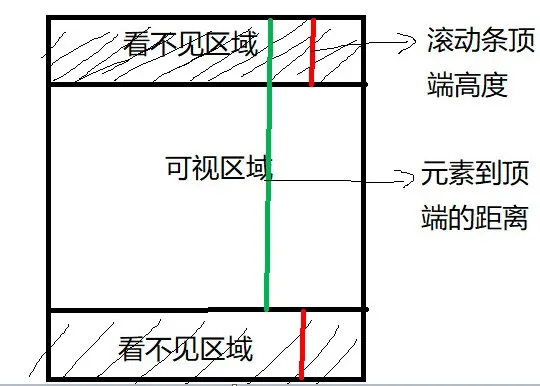
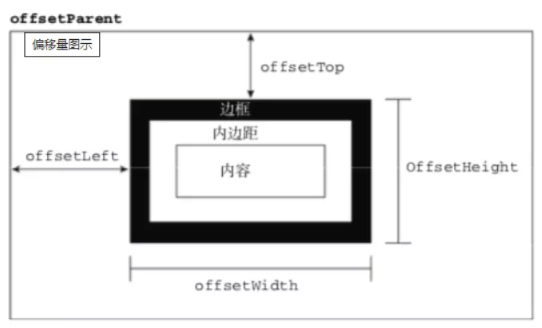
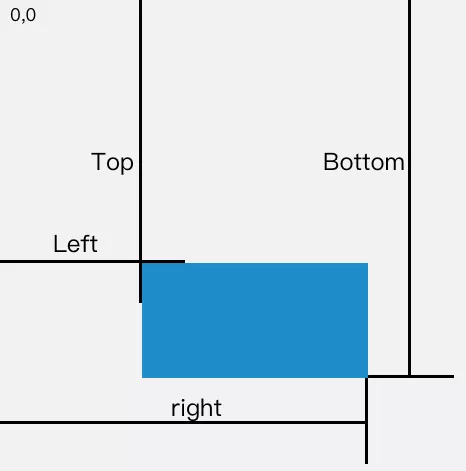

## JavaScript: 判断一个元素是否出现在可视区域中

### 用途
- 可视区域即我们浏览网页的设备肉眼可见的区域, 如下图


- 在日常开发中, 我们经常需要判断目标元素是否在视窗之内或者和视窗的距离小于一个值(例如 100 px), 从而实现一些常用的功能
- 1. 图片的懒加载
- 2. 列表的无限滚动
- 3. 计算广告元素的曝光情况
- 4. 可点击链接的预加载


### 实现方式
- 判断一个元素是否在可视区域, 我们常用的有三种办法:
- 1. offsetTop, scrollTop
- 2. getBoundingClientRect
- 3. Intersection Observer


### 🚀🚀🚀 offsetTop 和 scrollTop
- `offsetTop`: 元素的上外边框至包含元素的上内边框之间的像素据类,其他的offset属性如下


```js
function isInViewPortOfOne(el){
    // viewPortHeight: 当前可视的高度
    const viewPortHeight = window.innerHeight || document.documentElement.clientHeight || document.body.clientHeight

    // 距离上边
    const offsetTop = el.offsetTop
    // 滚动的位置
    const scrollTop = document.documentElement.scrollTop

    // 对比
    const top = offsetTop - scrollTop

    return top <= viewPortHeight

}
```

### 🚀🚀🚀 getBoundingClientRect
- 返回值是一个 `DOMRect`对象, 拥有`left, top, right, bottom, x, y, width, height`属性
```js
const target = document.querySelector('.target')
const clientRect = target.getBoundingClientRect()
console.info(clientRect)
```


- 当页面发生滚动的时候, top与left属性值都会随之改变
- 如果一个元素在视窗之内的话, 需要满足下面4个条件
```js
// 1. top 大于等于 0
// 2. left 大于等于 0
// 3. bottom: 小于等于视窗高度
// 4. right 小于等于视窗宽度

function isInViewPort(element){
    const viewWidth = window.innerWidth || document.documentElement.clientWidth
    const viewHeight = windpw.innerHeight || document.documentElement.clientHeight

    const {top, right, bottom, left } = element.getBoundingClientRect()
    
    return (
        top >= 0 && left >= 0 && right <= viewWidth && bottom <= viewHeight
    )
}
```

### 🚀🚀🚀 Intersection Observer
- Intersection Observer 即重叠观察者, 从这个命名就可以看出它用于判断两个元素是否重叠, 因为不用进行事件的监听, 性能方面相比getBoundingClientRect会好很多
- 使用步骤主要分为两步: `创建观察者` 和 `传入被观察者`
```js
// 创建观察者
const options = {
    // 标识重叠面积占被观察者的比例, 0-1取值, 1表示完全被包含
    threshold: 1.0,
    root: document.querySelector('#scrollArea') // 必须是模板元素的父级元素
}
const callback = (entries, observer) => { 
    entries.forEach(entry => {
        entry.time;               // 触发的时间
        entry.rootBounds;         // 根元素的位置矩形, 这种情况下为视窗位置
        entry.boundingClientRect; // 被观察者的位置举行
        entry.intersectionRect;   // 重叠区域的位置矩形
        entry.intersectionRatio;  // 重叠区域占被观察者面积的比例（被观察者不是矩形时也按照矩形计算）
        entry.target;             // 被观察者
    });
};
const observer = new IntersectionObserver(callback, options);

// 通过new IntersectionObserver创建了观察者 observer, 
// 传入的参数 callback 在重叠比例超过 threshold 时会被执行`


// 传入被观察者
const target = document.querySelector('.target');
observer.observe(target);
```