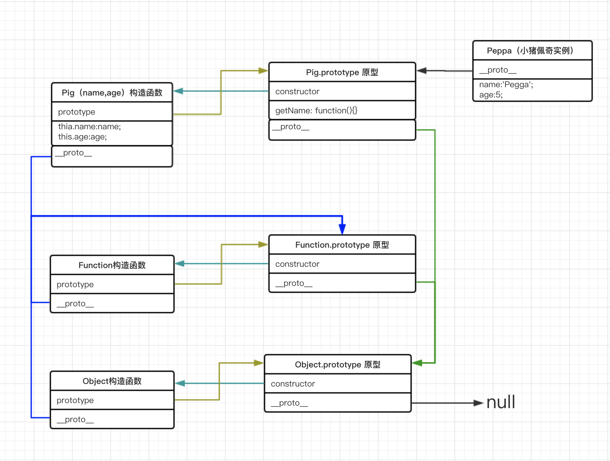

### JavaScript: 原型和原型链
- `prototype`: 每个函数都会有这个属性, 这里强调, <font color="#FF0000">是函数</font>,  <font color="#409FEE">普通对象</font>没有这个属性.(为什么说是普通对象呢,JS中,一切皆为对象,所以这里的普通对象不包括函数对象). `prototype`是构造函数的原型对象
- `__proto__`: 每个对象都有这个属性, 这里强调, <font color="#FF0000">是对象</font>, 同样函数也是对象, 所有函数也有这个属性. 它指向构造函数(创建实例的类)的原型对象 <也就是说对象的 `__proto__` 指向创建这个对象的类的原型对象`prototype`>
- `constructor`: 原型对象(`prototype`)上的一个指向构造函数的属性, 就是说 类的原型对象上constructor指向类本身(`Class.prototype.constructor===Class`)
- 构造函数(`function ClassName`)和构造方法(`constructor`)

```js
var webName = 'long'
function Pig(name, age){
    this.name = name
    this.age = age
}

var Peppa = new Pig('Peppa', 5)
console.info(Peppa.__proto__ === Pig.prototype) // 详细见 🚀解析 - 1

console.info(Pig.__proto__ === Function.prototype) // 详细见 🚀解析 - 2
console.info(Pig.prototype.constructor  === Pig) // 详细见 🚀解析 - 3

```

###  🚀 解析 - 1
- 在实例化的时候, <font color="#F56C6C" size="5">类的 prototype 上的属性 会作为 原型对象 赋值给 实例 </font>, 
- 也就是说, <font color="#E6A23C" size="5">Peppa的原型(`__proto__`) 就是从 Pig的原型对象(prototype)继承而来的</font> 
- 所以 <font color="#67C23A" size="5">Peppa.`__proto__` == Pig.prototype</font>

###  🚀 解析 - 2
- `Pig` 是一个函数对象, 它是 `Function`对象的一个实例, 所以  <font color="#E6A23C" size="5">Pig.`__proto__` === Function.prototype</font> 

###  🚀 解析 - 3
- 关于`constructor`这个属性, 它位于原型对象上并且指向`构造函数`
- 所以  <font color="#E6A23C" size="5">Pig.prototype.constructor === Pig</font>  
```js
console.info(Pig.prototype)
/*
    {
        constructor: function Pig(name, age){},
    }
*/
```
- `.__proto__` 是往上找构造函数的原型对象, `Peppa.__proto__` => `Pig.prototype`
