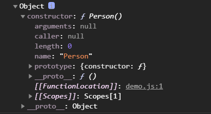
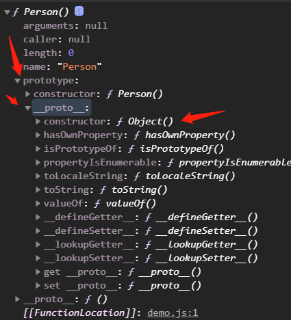

#### JavaScript中的原型链
```js
function Person(){}
const p = new Person()

console.dir(Person)
console.dir(Person.prototype)

console.dir(p)
console.dir(p.__proto__)

console.dir(Person.prototype === p.__proto__) // true
```

0. `🔵构造函数🔵`代指`Class / Function`
1. `🔵构造函数🔵`必然有`prototype`和`__proto__`两个属性, `prototype`是一个对象, `prototype`里面有一个`constructor`属性, 该属性指向`原型对象所属的构造函数`. 打印`Person.prototype`如下图:



2. 对象必然有`__proto__`,但不一定有`prototype`. 实例的对象通过`__proto__`属性连接到`🔵构造函数🔵`的`prototype`属性上. 打印`p.__proto__`


3. 可以得知: `Person.prototype` === `p.__proto__`
4. 原型链就是从这两者的关系一层一层的往下查找

#### prototype 和 __proto__
- `prototype`是构造函数的属性
- `__proto__`是实例对象的属性
- 它们都指向同一个对象 
```js
{
    constructor: Person(),
    __proto__: Object
}
```

#### Function VS Object
- `Function.prototype` 通过 `__proto__` 属性找到 `Object.prototype`, 可以得出`Function`其实是`Object`的实例对象



- 任何对象都属于`Object`的实例, 所以最终`__proto__`都会指向`Object.prototype`, 这就解释了`万物皆对象`


#### 原型链的核心
- 属性的独立和共享, 对对象实例需要独立的属性, 做法的本质都是在对象实例里面创建属性