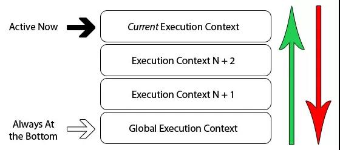

## JavaScript: 执行上下文和执行栈是什么?

### 🎃 一: 执行上下文
- 简单来说, 执行上下文是`JavaScript`代码执行环境的一种抽象概念,只要有`JavaScript`代码运行,那么它就一定是运行在执行上下文中
- 执行上下文的类型分为三种:
1. 全局执行上下文,只有一个,浏览器的全局对象就是 `window` 对象, `this` 指向这个全局对象
2. 函数执行上下文,存在无数个, 只有函数在被调用的时候才会被创建, 每次调用函数都会创建一个新的执行上下文
3. `Eval`函数执行上下文, 指的是运行在`eval`函数中的代码, 很少用且不建议使用


- 紫色框住的部分为全局上下文, 蓝色和橘色框起来的是不同的函数上下文, 只有全局上下文(的)变量能被其他任何上下文访问.
- 可以有任意多个函数上下文, 每次调用函数创建一个新的上下文,会创建一个私有作用域, 函数内部生命的任何变量都不能在当前函数作用域外部直接访问


### 🎃 二: 生命周期
- 执行上下文的生命周期包括三个阶段: `创建阶段` -> `执行阶段` -> `回收阶段`

#### 生命周期 - 创建阶段
- 创建阶段即函数被调用, 但未执行任何内部代码之前, 创建阶段做了三件事
1. 确定 `this` 的值, 也被称为 `This Binding`
2. `LexicalEnvironment`: 词法环境组件 被创建
3. `VariableEnvironment`: 变量环境组件 被创建
```js
var ExecutionContext = {
     ThisBinding = <this value>,     // 确定this 
    LexicalEnvironment = { ... },   // 词法环境
    VariableEnvironment = { ... },  // 变量环境
}
```
- `This Binding`: 确定 `this` 的值, 我们前面讲到, `this` 的值是在执行的时候才能确认, 定义的时候不能确认
- `词法环境`: 两个组成部分: 
- - <1>-全局环境: 是一个没有外部环境的词法环境, 其外部环境引用为null, 有一个全局对象, this的指向就是这个全局对象
- - <2>-函数环境: 用户在函数中定义的变量被存储在环境记录中, 包含了 `arguments`对象, 外部环境的引用可以是全局环境, 也可以是包含内部函数的外部函数环境
```js
GlobalExectionContext = {  // 全局执行上下文
  LexicalEnvironment: {       // 词法环境
    EnvironmentRecord: {     // 环境记录
      Type: "Object",           // 全局环境
      // 标识符绑定在这里 
      outer: <null>           // 对外部环境的引用
  }  
}

FunctionExectionContext = { // 函数执行上下文
  LexicalEnvironment: {     // 词法环境
    EnvironmentRecord: {    // 环境记录
      Type: "Declarative",      // 函数环境
      // 标识符绑定在这里      // 对外部环境的引用
      outer: <Global or outer function environment reference>  
  }  
}
```
- `变量环境`: 变量环境也是一个词法环境,因此它具有上面定义的词法环境的所有属性, 在`ES6`中, 词法环境和变量环境的区别在于前者用于存储函数声明和变量(let,const)绑定, 二后者仅用于存储变量(var)绑定
```js
let a = 20;  
const b = 30;  
var c;

function multiply(e, f) {  
 var g = 20;  
 return e * f * g;  
}
c = multiply(20, 30);
```
- 执行上下文如下：
```js
GlobalExectionContext = {

  ThisBinding: <Global Object>,

  LexicalEnvironment: {  // 词法环境
    EnvironmentRecord: {  
      Type: "Object",  
      // 标识符绑定在这里  
      a: < uninitialized >,  
      b: < uninitialized >,  
      multiply: < func >  
    }  
    outer: <null>  
  },

  VariableEnvironment: {  // 变量环境
    EnvironmentRecord: {  
      Type: "Object",  
      // 标识符绑定在这里  
      c: undefined,  
    }  
    outer: <null>  
  }  
}

FunctionExectionContext = {  
   
  ThisBinding: <Global Object>,

  LexicalEnvironment: {  
    EnvironmentRecord: {  
      Type: "Declarative",  
      // 标识符绑定在这里  
      Arguments: {0: 20, 1: 30, length: 2},  
    },  
    outer: <GlobalLexicalEnvironment>  
  },

  VariableEnvironment: {  
    EnvironmentRecord: {  
      Type: "Declarative",  
      // 标识符绑定在这里  
      g: undefined  
    },  
    outer: <GlobalLexicalEnvironment>  
  }  
}
```
- 留意上面的代码, `let` 和 `const` 定义的变量a和b在创建阶段没有被赋值, 但var声明的变量从在创建阶段被赋值为undefined
- 这是因为, 创建阶段, 会在代码中扫描变量和函数声明, 然后将函数声明存储在环境中
- 但变量会被初始化为undefined(var声明的情况下)和保持uninitialized(未初始化状态)(使用let和const声明的情况下)
- 这就是变量提升的实际原因

#### 生命周期 - 执行阶段
- 在这阶段, 执行变量赋值、代码执行 如果 `Javascript` 引擎在源代码中声明的实际位置找不到变量的值, 那么将为其分配 `undefined` 值

#### 生命周期 - 回收阶段
- 执行上下文出栈等待虚拟机回收执行上下文


### 🎃 三: 执行栈
- 执行栈: 也叫做调用栈, 后进先出的结构, 用于存储在代码执行期间创建的所有执行上下文.


- 当Javascript引擎开始执行你第一行脚本代码的时候, 它就会创建一个全局执行上下文然后将它压到执行栈中
- 每当引擎碰到一个函数的时候, 它就会创建一个函数执行上下文, 然后将这个执行上下文压到执行栈中
- 引擎会执行位于执行栈栈顶的执行上下文(一般是函数执行上下文), 当该函数执行结束后, 对应的执行上下文就会被弹出, 然后控制流程到达执行栈的下一个执行上下文
```js
let a = 'Hello World!';
function first() {
  console.log('Inside first function');
  second();
  console.log('Again inside first function');
}
function second() {
  console.log('Inside second function');
}
first();
console.log('Inside Global Execution Context');
```


简单分析一下流程：

1. 创建全局上下文请压入执行栈
2. first函数被调用, 创建函数执行上下文并压入栈
3. 执行first函数过程遇到second函数, 再创建一个函数执行上下文并压入栈
4. second函数执行完毕, 对应的函数执行上下文被推出执行栈, 执行下一个执行上下文first函数
5. first函数执行完毕, 对应的函数执行上下文也被推出栈中, 然后执行全局上下文
6. 所有代码执行完毕, 全局上下文也会被推出栈中, 程序结束