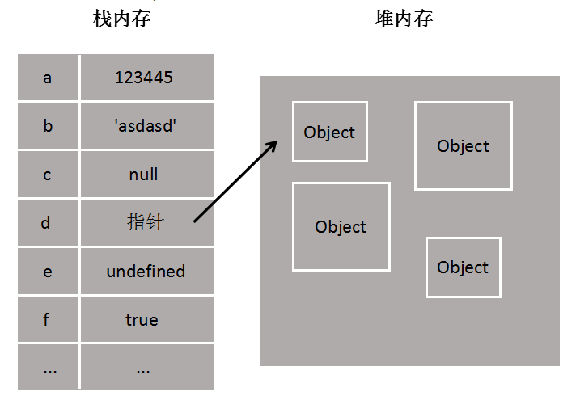

### JavaScript: var, let, const
- Q1: `var`,  `let` ,  `const`  的区别
- A1: 区别如下:
- 1. `var`声明的变量会挂载在window上, 而 `let` 和 `const` 声明的变量不会
- 2. `var`声明变量存在变量提升,  `let` 和 `const` 不存在变量提升
- 3. `let` 和 `const` 声明形成块作用域
- 4. 同一作用域下 `let` 和 `const` 不能声明同名变量, 而`var`可以
- 5. 暂存死区 ( `let`  和 `var` 不同是, 在变量声明之前就访问变量的话, 会直接提示 `ReferenceError`, 而不像 `var` 那样使用默认值 `undefined`) `====>` (ES6明确规定, 如果区块中存在 `let` 命令, 这个区块对这些命令声明的变量, 从一开始就形成了封闭作用域.凡是在声明之前就使用这些变量, 就会报错.所以在代码块内, 使用 `let` 命令声明变量之前, 该变量都是不可用的.这在语法上, 称为“暂时性死区”（temporal dead zone, 简称 TDZ）.)
- Q2: `const` 定义的值能改么?
- A2: 部分能改,部分不能改

### JavaScirpt 中的堆内存(Heap)与栈内存(Stack)
- 在`JavaScript`对变量的存储主要有两种位置: `栈内存`和`堆内存`
- 和`Java`类似, `栈内存`中主要用于存储各种<font color="red">基本类型</font>的变量: `Boolean`, `Number`, `String`, `Undefined`, `Null`, 以及对象变量的指针. 此时 `栈内存`给人的感觉就像一个线性排列的空间,每个小单元大小基本相等
- 而`堆内存`主要负责存储对象`Object`这种变量类型.如下图



- `栈内存`中的变量一般都是已知大小或者有范围上限的,算作是一种简单存储
- `堆内存`中存储的对象类型数据大小`未知`, 这也是为什么 `null` 作为一个`object`类型的变量却存储在栈内存当中的原因
- 基于以上两点: 
- 1. 💛 当我们使用`const对象`的时候, 我们说的常量其实是指针, 就是`const对象`对应的`堆内存指向`是不变的,但是`堆内存中的数据`本身的大小或者属性是可变的. 
- 2. 💛 当我们使用`const基础变量`的时候, 这个值就相当于`const`对象的指针.是不可变的.
- 3. 💛 既然知道了`const`在内存中的存储, 那么`const`,`let`定义的变量不能二次定义的流程就比较清晰了, 每次使用`const`或者`let`去初始化一个变量的时候, 会首先遍历当前的`栈内存`,看看有没有重名变量,有的话就返回错误
- 4. 容易忽略的问题: 使用`new`关键字初始化的内容也存放在`堆内存`中, 因为它们不再是一个基础变量,而是一个对象
```js
var a = new String('123') // new
var b = String('123') // 工厂模式
var c = '123' // 字面量

console.info(a == b) // true
console.info(a === b) // false
console.info(b == c) // true
console.info(a === b) // true
console.info(a == c) // true
console.info(a === b) // false
console.info(typeof a) // object
// 💛 可以以看到new一个String, 出来的是对象, 而直接字面量赋值和工厂模式出来的都是字符串

var aa = new String('123')
var bb = new String('123')
console.info(aa == bb) // false
console.info(aa === bb) // false

// 💛 很明显, 如果 a, b 是存储在栈内存的话, 两者明显是相等的, 就像 null === null 是 true 一样, 
// 💛 但是两者并不相同, 说明两者都是存储在堆内存中的, 指针指向也不同
```
- 🧡 说到这里, 我们常说的`值类型`和`引用类型`其实说的就是`栈内存变量`和`堆内存变量`
- 🧡 再深入想, `值传递` 和 `引用传递`, `深拷贝` 和 `浅拷贝`,都是围绕 `栈内存` 和 `堆内存` 展开的,一个`处理值`,一个`处理指针`

### 内存分配和垃圾回收
- 一般来说, `栈内存`线性有序存储, 容量小, 系统分配率高. `堆内存`首先要在`堆内存`新分配存储区域,之后又要把指针存储到`栈内存`中,效率相对低一些.
- 垃圾回收方面: `栈内存`变量基本上用完就回收了, 而`堆内存`中的变量因为存在很多不确定的引用,只有当所有调用的变量全部销毁之后才能回收