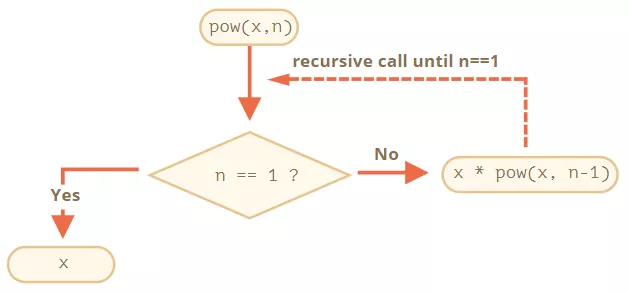

## JavaScript: 浅谈JS中的 递归 和 尾递归

### 递归
- 递归 `Recursion`, 在数学与计算机科学中, 是指载函数的定义中使用函数自身的方法
- 在函数内部, 可以调用其他函数. 如果一个函数在内部调用自身本身, 那么这个函数就是`递归函数`
- 其核心思想就是把一个大型复杂的问题层层转化为一个与原问题相似的规模较小的问题来求解
- 一般来说, 递归需要有边界条件, 递归前进阶段和递归返回阶段. 当边界条件不满足时, 递归前进, 当边界条件满足时, 递归结束.

- `使用迭代的方式` 实现一个函数 `pow(x, n)`, 它可以计算 `x` 的 `n` 次方
```js
function pow(x, n) {
  let result = 1

  // 循环中, 用 x 乘以 result n 次
  for (let i = 0; i < n; i++) {
    result = result * x
  }

  return result
}

console.info(pow(10, 3))
```

- `使用递归的方式`
```js
function pow(x, n) {
  if (n == 1) {
    return x
  } else {
    return x * pow(x, n - 1)
  }
}
console.info(pow(10, 4))
```
- `pow(x, n)` 被调用时, 执行分为两个分支
```bash
            -> if (n == 1) => x
pow(x, n) ->
            -> else => x * pow(x, n-1)
```
- 也就是说 pow 递归调用自身, 直到 n == 1



- 为了计算 `pow(2,4)`, 递归变体经过了下面几个步骤
1. `pow(2,4)` = `2 * pow(2,3)`
2. `pow(2,3)` = `2 * pow(2,2)`
3. `pow(2,2)` = `2 * pow(2,1)`
4. `pow(2,1) = 2`
- 因此, 递归将函数调用简化为一个更简单的函数调用, 然后再将其简化为一个更简单的函数,以此类推, 直到结束


### 尾递归
- 尾递归, 即在函数尾位置调用自身(或是一个尾调用本身的其他函数等等). 尾递归也是递归的一种特殊情形. 尾递归是一种特殊的尾调用, 即在尾部直接调用自身的递归函数
- 尾递归在普通尾调用的基础上, 多出了2个特征
1. 在尾部调用的是函数自身
2. 可通过优化, 使得计算仅占用常量栈空间
- 在递归调用的过程当中系统为每一层的返回点, 局部量等开辟了栈来存储, 递归次数过多容易造成栈溢出
- 这时候我们就可以使用尾递归, 即一个函数中所有递归形式的调用都出现在函数的末尾, 对于尾递归来说, 由于只存在一个调用记录, 所以用不会发生`栈溢出`的错误
- 阶乘: `普通的递归`
```js
function factorial(n) {
  if (n == 1) {
    return n
  }
  return n * factorial(n - 1)
}
const res = factorial(5)
console.info('res', res)
```
- 如果 n = 5, 这个方法要执行5次, 才返回最终的计算表达式, 这样每次都要保存这个方法, 就容易造成栈溢出, 复杂度为O(n)

- 使用尾递归实现阶乘
```js
function factorial(n, total) {
  if (n === 1) return total
  return factorial(n - 1, n * total)
}

const res = factorial(5, 6)
console.info('res', res)
```
- 可以看到, 每一次返回的就是一个新的函数, 不带上一个函数的参数, 也就不需要储存上一个函数了。尾递归只需要保存一个调用栈, 复杂度 O(1)


## 应用场景
- 数组求和
```js
function sum(arr, total) {
  if (arr.length === 1) {
    return total
  } else {
    return sum(arr, total + arr.pop())
  }
}

const nums = [10, 20, 30, 40, 50]
sum(nums, nums[0])

```

- 数组扁平化
```js
let a = [1, 2, 3, [1, 2, 3, [1, 2, 3]]]
// 变成
let a = [1, 2, 3, 1, 2, 3, 1, 2, 3]
// 具体实现
function flat(arr = [], result = []) {
  arr.forEach((v) => {
    if (Array.isArray(v)) {
      result = result.concat(flat(v, []))
    } else {
      result.push(v)
    }
  })
  return result
}

```