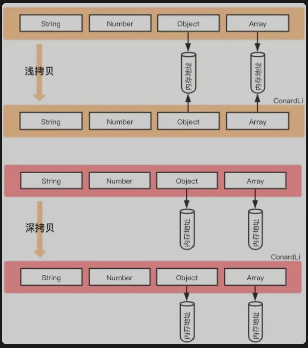

## JavaScript: 深拷贝浅拷贝的区别,如何实现一个深拷贝?

### 数据类型存储
- 基本类型: 数据保存在栈中
- 引用类型: 数据保存在堆中,引用数据类型的变量是一个指向堆内存中实际对象的引用, 存储在栈中


### 浅拷贝
- 浅拷贝指的是创建新的数据, 这个数据有着原始数据属性值的一份精确拷贝.
- 如果属性是基本类型, 拷贝的就是`基本类型的值`. 如果属性是引用类型, 拷贝的就是`内存地址`
- 也就是说 浅拷贝是拷贝一层, 深层次的`引用类型`则共享内存地址
```js
function shallowClone(obj){
    /*
    - `hasOwnPropery`: 不会去判断原型变量和方法
    - `in`: 会去判断原型变量和方法
    */
    const newObj = {}
    for(let prop in obj){
        if(obj.hasOwnProperty(prop)){
            newObj[prop] = obj[prop]
        }
    }
    return newObj

    var obja = {name:'kes',age:12, hobby:[1,2,3,4]}
    var objb = shallowClone(obja)

    obja.age = 22 // 修改基本类型不会影响
    obja.gender = 'male' // 修改基本类型不会影响
    obja.hobby[0] = {inner: 'inner value'} // 会影响 

    console.info(obja) // obja 的 hobby 和  objb的一样了
    console.info(objb) 
}
```
- 在`JavaScript`中, 存在浅拷贝的方法有: 
- `Object.assign()`, 
- `Array.prototype.slice()`,`Array.prototype.concat()`
- 使用展开运算符`...`


### 深拷贝
- 深拷贝开辟一个新的栈, 两个对象属性完全相同, 但是对应两个不同的地址, 修改一个对象的属性不会改变另一个对象的属性
- 常见的拷贝方式
- 1. `loadash.cloneDeep()`
- 2. `jQuery.extend()`
- 3. `JSON.stringify()`
- 4. 手写循环递归
```js
function deepClone(obj, hash = new WeakMao()){
    if(obj === null) return obj // 如果是 null 或者 undefined 就不进行拷贝操作
    if(obj instanceof Date) return new Date(obj)
    if(obj instanceof RegExp) return new RegExp(obj)
    // 可能是对象或者是普通的值, 如果是函数的话是不需要深拷贝
    if(typeof obj !== 'object') return obj
    // 是对象的话就要进行深拷贝
    if(hash.get(obj)) return hash.get(obj)
    let cloneObj = new obj.constructor()
    // 找到的是所属类原型上的constructor,而原型上的 constructor指向的是当前类本身
    hash.set(obj, cloneObj)
    for(let key in obj){
        if(obj.hasOwnProperty(key)){
            // 实现一个递归拷贝
            cloneObj[key] = deepClone(obj[key],hash)
        }
    }

    return cloneObj
}
```

### 区别


- 从图中可以发现, 深拷贝和浅拷贝都创建出一个新的对象, 但在赋值对象属性的时候, 行为就不一样
- 浅拷贝只复制`属性`指向某个对象的指针, 而不复制对象本身, 新旧对象还是共享同一块内存, 修改对象属性会影响源对象
```js
// 浅拷贝
const oldObj = {
    name : 'init',
    arr : [1,[2,3],4]
};
const newObj = shallowClone(oldObj) // 一个浅拷贝方法
newObj.name = "update";
newObj.arr[1] = [5,6,7] ; // 新旧对象还是共享同一块内存

console.log('oldObj', oldObj) // oldObj { name: 'init',  arr: [ 1, [ 5, 6, 7 ], 4 ] }
console.log('newObj', newObj) // newObj { name: 'update', arr: [ 1, [ 5, 6, 7 ], 4 ] }
```
- 
```js
// 深拷贝
const oldObj = {
    name : 'init',
    arr : [1,[2,3],4],
};
const newObj = deepClone(oldObj) // 一个深拷贝方法
newObj.name = "update";
newObj.arr[1] = [5,6,7] ; // 新对象跟原对象不共享内存

console.log('oldObj', oldObj) // oldObj { name: 'init', arr: [ 1, [ 2, 3 ], 4 ] }
console.log('newObj', newObj) // newObj { name: 'update', arr: [ 1, [ 5, 6, 7 ], 4 ] }
```

### 小结
- 前提为拷贝类型为引用类型的情况下:
- 1. 浅拷贝是拷贝一层, 属性为对象时, 浅拷贝是复制, 两个对象指向同一个地址
- 2. 深拷贝是递归拷贝深层次, 属性为对象时, 深拷贝时新开栈, 两个对象指向不同的地址