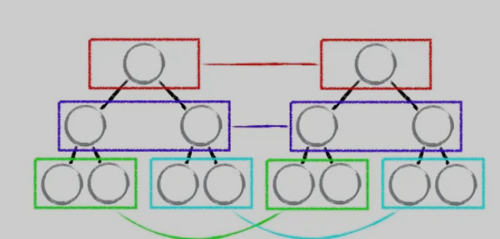
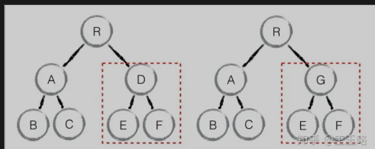

## React: diff
- 传统 `diff` 算法的时间复杂度是 `O(n^3)`,这在前端 `render` 中是不可接受的.为了降低时间复杂度,`react` 的 `diff` 算法做了一些妥协,放弃了最优解,最终将时间复杂度降低到了 `O(n)`. 那么 `react diff` 算法做了哪些妥协呢? 参考如下:

### tree diff: 只对比同一层的 dom 节点, 忽略 dom 节点的跨层级移动
- 如下图, react 只会对相同颜色方框内的 DOM 节点进行比较, 即同一个父节点下的所有子节点.当发现节点不存在时, 则该节点及其子节点会被完全删除掉, 不会用于进一步的比较.

- 这就意味着,如果 dom 节点发生了跨层级移动,react 会删除旧的节点,生成新的节点,而不会复用.

### component diff: 如果不是同一类型的组件, 删除旧的组件, 创建新的组件

### element diff: 对于同一层级的一组子节点, 需要通过唯一id进行区别
- 如果没有 `id` 来进行区分,一旦有插入动作,会导致插入位置之后的列表全部重新渲染.这也是为什么渲染列表时为什么要使用唯一的 key.