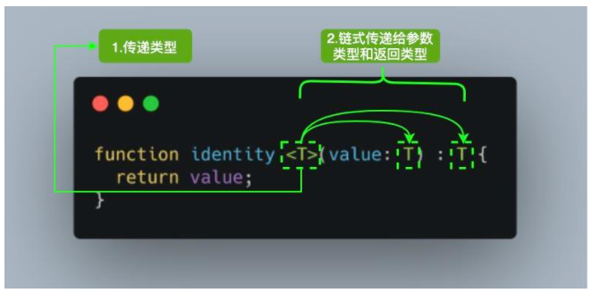
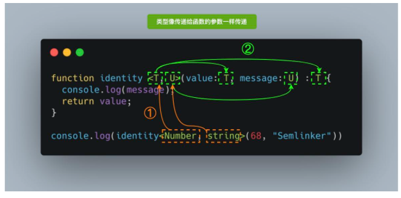

## TypeScript: 读懂 TypeScript 泛型及应用


### 🚀 泛型是什么?
- 软件工程中,我们不仅要创建一致的定义良好的 API,同时也要考虑可重用性. 组件不仅能够支持当前的数据类型,同时也能支持未来的数据类型,这在创建大型系统时为你提供了十分灵活的功能.
- 在像 C# 和 Java 这样的语言中, 可以使用泛型来创建可重用的组件, 一个组件可以支持多种类型的数据. 这样用户就可以以自己的数据类型来使用组件. 
- 设计泛型的关键目的在成员之间提供有意义的约束, 这些成员可以是: `类的实例成员`, `类的方法`, `函数参数` 和  `函数返回值`
- 为了便于大家更好地理解上述的内容, 我们来举个例子, 在这个例子中, 我们将一步步揭示泛型的作用. 首先我们来定义一个通用的 identity 函数, 该函数接收一个参数并直接返回它: 
```js
function identity(value) {
  return value
}
console.info(identity(1)) // 1
```
- 现在, 我们将 `identity` 函数做适当的调整, 以支持 `TypeScript` 的 `Number` 类型的参数:
```ts
function identity(value: Number): Number {
  return value
}
console.info(identity(1)) // 1
```
- 这里 `identity` 的问题是我们将 `Number` 类型分配给参数和返回类型, 使该函数仅可用于该原始类型. 但该函数并不是可扩展或通用的, 很明显这并不是我们所希望的. 
- 我们确实可以把 `Number` 换成 `any`, 我们失去了定义应该返回哪种类型的能力, 并且在这个过程中使编译器失去了类型保护的作用. 我们的目标是让 `identity` 函数可以适用于任何特定的类型, 为了实现这个目标, 我们可以使用泛型来解决这个问题, 具体实现方式如下
```ts
// 🚀🚀🚀 Step - 3
function identity3<T>(value: T): T {
  return value
}
```
- 对于刚接触 `TypeScript` 泛型的读者来说, 首次看到 <T> 语法会感到陌生. 但这没什么可担心的, 就像传递参数一样, 我们传递了我们想要用于特定函数调用的类型. 



- 上面的图片中, 当我们调用`identity<Number>(1)`,`Number`类型就像参数`1`一样, 它将出现在`T`的任何位置填充该类型. 图中`<T>`内部的`T`被称为`类型变量`, 它是我们希望传递给`identity`函数的类型占位符. 同时它被分配给`value`参数用来代替它的类型, 此时 `T`充当的是类型, 而不是特定的`Number类型`
- 其中`T`代表`Type`, 在定义泛型时通常用作第一个类型变量名称. 但实际上`T`可以用做任何有效名称代替, 除了`T`之外,以下是常见泛型变量代表的意思
- `K(Key)`: 表示对象中的键类型
- `V(Value)`: 表示对象中的值类型
- `E(Element)`: 表示元素类型

- 其实并不是只能定义一个类型变量, 我们可以引入希望定义的任何数量的类型变量. 比如我们引入一个新的类型变量`U`, 用于扩展定义我们的`identity`函数
```ts
function identity4<T, U>(value: T, message: U): T {
  console.info(message)
  return value
}
console.log(identity4<Number, string>(68, 'Semlinker'))
```


- 除了为类型变量显式设定值之外, 一种更常见的做法是使编译器自动选择这些类型, 从而使代码更简洁. 我们可以完全省略尖括号, 比如: 
```ts
function identity5<T, U>(value: T, message: U): T {
  console.info(message)
  return value
}
console.log(identity5(68, 'Semlinker'))
```
- 对于上述代码, 编译器足够聪明, 能够知道我们的参数类型, 并将它们赋值给 T 和 U, 而不需要开发人员显式指定它们.
- 如你所见, 该函数接收你传递给它的任何类型, 使得我们可以为不同类型创建可重用的组件. 现在我们再来看一下 `identity` 函数: 
```ts
function identity <T, U>(value: T, message: U) : T {
  console.log(message);
  return value;
}
```
- 相比之前定义的 `identity` 函数, 新的 `identity` 函数增加了一个类型变量 `U`, 但该函数的返回类型我们仍然使用 `T`. 如果我们想要返回两种类型的对象该怎么办呢？针对这个问题, 我们有多种方案, 其中一种就是使用`元组`, 即为`元组`设置通用的类型: 
```ts
function identity6<T, U>(value: T, message: U): [T, U] {
  console.info(message)
  return [value, message]
}
console.log(identity6(68, 'Semlinker'))
```
- 虽然使用元组解决了上述的问题, 但有没有其它更好的方案呢？答案是有的, 你可以使用泛型接口


### 🚀 泛型接口
- 为了解决上面提到的问题, 首先让我们创建一个用于的 `identity` 函数通用 `Identities` 接口:
```ts
interface Identities<V, M> {
  value: V
  message: M
}
```
- 在上述的 `Identities` 接口中, 我们引入了类型变量 `V` 和 `M`, 来进一步说明有效的字母都可以用于表示类型变量, 之后我们就可以将 `Identities` 接口作为 `identity` 函数的返回类型:
```ts
interface Identities<V, M> {
  value: V
  message: M
}

function identity<T, U>(value: T, message: U): Identities<T, U> {
  console.info(`${value}: ${typeof value}`)
  console.info(`${message}: ${typeof message}`)
  let identities: Identities<T, U> = {
    value,
    message,
  }
  return identities
}
console.info(identity<Number, String>(68, 'finder'))
```
- 以上代码成功运行后, 在控制台会输出以下结果:
```js
// 68: number
// Semlinker: string
// {value: 68, message: "Semlinker"}
```

### 🚀 泛型类
- 在类中使用泛型也很简单, 我们只需要在类名后面, 使用 <T, ...> 的语法定义任意多个类型变量, 具体示例如下:
```ts
interface PersonInterface<U> {
  value: U
  getIdentity: () => U
}

class IdentityClass<T> implements PersonInterface<T> {
  value: T

  constructor(value: T) {
    this.value = value
  }

  getIdentity(): T {
    return this.value
  }
}

const p1 = new IdentityClass<string>('Leslie')
console.info(`p1 value ${p1.value}`) // p1 value Leslie
console.info(`p1.getIdentity()  ${p1.getIdentity()}`) // p1.getIdentity()  Leslie

const p2 = new IdentityClass<number>(1943)
console.info(`p2 value ${p2.value}`) // p2 value 1943
console.info(`p2.getIdentity()  ${p2.getIdentity()}`) // p2.getIdentity()  1943
```
- 我们看下实例化`p1`的调用过程
1. 在实例化`IdentityClass`的对象是, 我们传入`string`类型和构造函数参数值`Leslie`;
2. 之后在`IdentityClass`类中, 类型变量`T`的值变成`String`类型
3. `IdentityClass`类实现了`PersonInterface<T>`,而此时`T`表示`String`类型,因此等价于该类实现了`PersonInterface<String>`接口
4. 而对于`PersonInterface<U>`来说, 类型变量`U`变成了`String`. 这里有意使用不同的变量名, 以表明类型值沿链向上传播, 且与变量名无关.

- `泛型类`可确保在整个类中一致地使用指定的数据类型. 比如, 你可能已经注意到在使用 `Typescript` 的 `React` 项目中使用了以下约定：
```ts
type Props = {
  className?: string
   ...
};

type State = {
  submitted?: bool
   ...
};
class MyComponent extends React.Component<Props, State>{}
```
- 在以上代码中, 我们将泛型与 `React` 组件一起使用, 以确保组件的 `props` 和 `state` 是类型安全的.
- 相信看到这里一些读者会有疑问, 我们在什么时候需要使用泛型呢？通常在决定是否使用泛型时, 我们有以下两个参考标准：
1. 当`函数`,`接口`或`类`将处理多种数据类型时.
2. 当`函数`,`接口`或`类`在多个地方使用该数据类型时.

- 很有可能你没有办法保证在项目早期就使用泛型的组件, 但是随着项目的发展, 组件的功能通常会被扩展. 这种增加的可扩展性最终很可能会满足上述两个条件, 在这种情况下, 引入泛型将比复制组件来满足一系列数据类型更干净. 

