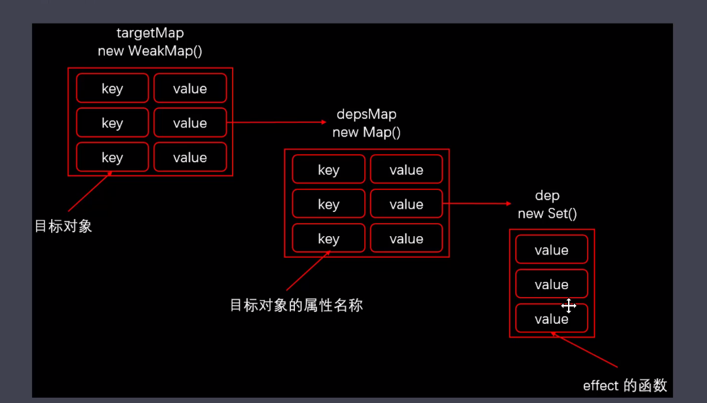
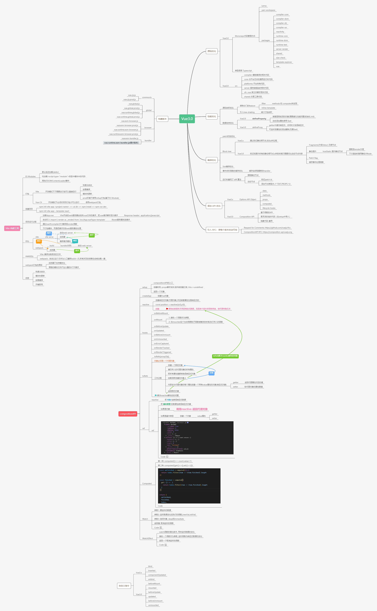

#### 1、Vue 3.0 性能提升主要是通过哪几方面体现的？
- 1: 源码优化
- - 1.1 Monorepo代码管理方式
- - 1.2 类型语言 Typescript
- 2: 性能优化
- - 2.1 源码体积优化 (移除冷门的feature / 引入tree-shaking)
- - 2.2 数据劫持优化 `defineProxy` (getter中递归响应式，访问时才变成响应式)(可监听到属性的添加删除(无需$set))
- 3: 编译优化
- - 3.1 patch阶段优化
- - 3.2 Block tree (标记和提升所有的静态根节点,diff的时候只需要对比动态节点内容)
- - 3.3 Slot编译优化
- - 3.4 事件侦听函数的缓存优化 (缓存会获取最新的handler)
- - 3.5 运行时重写了 diff 算法
- 4: 语法 API 优化
- - 4.1 基于函数的API
- - 4.2 更灵活的组织代码（在setup中导入）
- - 4.3 抽象代码-重用
- 5: 引入 RFC：使每个版本改动可控

#### 2、Vue 3.0 所采用的 Composition Api 与 Vue 2.x使用的Options Api 有什么区别？
- `Composition Api` setup作为入口,导入封装的模块
- `Composition Api` 可以作为提取为单独的模块,将相关的业务代码写在一起
- `Composition Api` 更便于抽象逻辑
- `Options Api` 将业务代码混在一起使用,查找代码不方便,如果有共通逻辑，需要提取`mixin`文件
- 简单的页面适合`Options Api`,大型复杂的页面适合`Composition Api`

#### 3、Proxy 相对于 Object.defineProperty 有哪些优点？
- `defineProperty` 嵌套层级较深时，需要递归内层属性,会导致性能问题
- `defineProperty` 在 `init`阶段就会执行,会导致性能问题
- `defineProperty` 无法监听属性的添加和删除,需要借助 `$set`, `$delete`
- `defineProxy` 在访问时(`getter`)时才会将数据编程响应式的
- `defineProxy` 可以监听属性的添加和删除

#### 4、Vue 3.0 在编译方面有哪些优化？
- `patch`阶段的优化
- `Block tree` 标记和提升所有的静态根节点,diff的时候只需要对比动态节点内容, 引入`Fragments`片段的概念,无需根节点,使用`hosiStatic`提升静态节点, 将静态节点提取到 `render`外层，下次渲染时直接复用静态`VNode`
- `Slot`编译优化
- 事件侦听函数的缓存优化: 缓存会获取最新的handler
- 编译运行时重写了 `diff`算法,对于静态节点,执行标记`patch id`并且添加节点类型  

#### 5、Vue.js 3.0 响应式系统的实现原理？
- 分别使用 `reactive`, `ref`, `toRefs`,`computed`去定义响应式的数据
- 其核心是`reactive`函数
- `reactive`函数内部实现过程
- - 定义 `get` 方法: 搜集依赖, 使用`Reflect.get`返回结果
- - 定义 `set` 方法: 触发更新, 返回`Reflect.set`的结果
- - 定义 `deleteProperty` 方法: 触发更新 返回`Reflect.deleteProperty`的结果

- 依赖搜集过程和触发更新的操作，如图
  

- `ref`内部调用 `reactive`方法
- `toRefs`内部也是使用了`reactive`的`getter`，代理对象的属性会自动搜集依赖
- `computed`内部执行了`ref`方法

## 详细的图解
  
