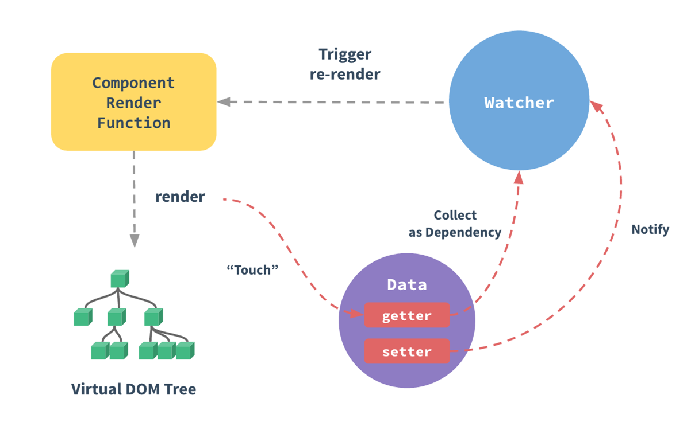
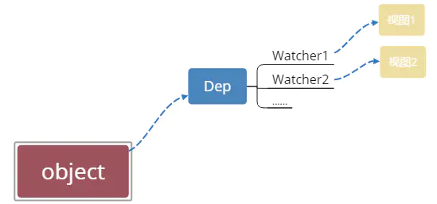

## Vue: vue响应式详解

### 🚀 1. 什么是Vue响应式
- 什么是Vue响应式: `数据发生变化后,页面会重新进行渲染`, 这就是 Vue 的响应式



### 🚀 2. 整个过程,需要做什么
- 侦测数据的变化  ====> `数据劫持 / 数据代理`
- 搜集视图依赖了哪些数据 ====> `依赖搜集`
- 数据变化时, 自动"通知"需要更新的视图部分,并进行更新 ====> `发布订阅模式`


### 🚀 3. 如何侦测数据的变化
- 方法1: `Object.defineProperty`
- 方法2: `ES6`的`Proxy`

#### 💛 Object.defineProperty的实现
- `Vue`通过设定对象属性的`getter/setter`方法来监听数据的变化,通过`getter`进行依赖搜集,而每个`setter`方法就是一个`观察者`,在数据变更的时候通知`订阅者`更新视图
```js
let data = {
  name: '荣光无限',
  location: { x: 100, y: 100 },
}

function render() {
  // set 的时候走这, 重新渲染
  console.info('模拟视图渲染')
}

// 把数据变成响应式的
observer(data)

// 观察者
function observer(obj) {
  // 判断类型
  if (!obj || typeof obj !== 'object') {
    return
  }

  Object.keys(obj).forEach((key) => {
    defineReactive(obj, key, obj[key])
  })
}

// 响应式
function defineReactive(obj, key, value) {
  // 递归子属性
  observer(value)

  Object.defineProperty(obj, key, {
    enumerable: true, //可枚举（可以遍历）
    configurable: true, //可配置（比如可以删除）
    get: function () {
      console.info('get', value)
      return value
    },
    set: function (newVal) {
      observer(newVal)
      if (newVal != value) {
        console.info('set', newVal)
        render()
        value = newVal
      }
    },
  })
}

data.location = { x: 1000, y: 2000 } // set {x: 1000,y: 1000} 模拟视图渲染
data.name //  荣光无限
```
- 上面这段代码的主要作用在于 `observer`这个函数传入一个`obj(需要被追踪变化的对象)`,通过遍历所有属性的方式对该对象的每一个属性都通过 `defineReactive` 处理,给每个属性加上 `set` 和 `get` 方法,以此来达到实现侦测对象变化. 值得注意的是, `observe` 会进行递归调用,那我们如何侦测`Vue`中 `data` 中的数据, 其实也很简单
```js
class Vue {
    /* Vue构造类 */
    constructor(options) {
        this._data = options.data;
        observer(this._data);
    }
}
// 这样我们只要 new 一个 Vue 对象, 就会将 data 中的数据进行追踪变化. 
// 但是我们发现一个问题, 上面的代码无法检测到对象属性的添加或删除(如data.location.a=1,增加一个a属性)
```
- 这是因为 `Vue` 通过`Object.defineProperty`来将对象的`key`转换成`getter/setter`的形式来追踪变化, 但`getter/setter`只能追踪一个数据是否被修改, 无法追踪新增属性和删除属性. 如果是删除属性, 我们可以用`vm.$delete`实现, 那如果是新增属性, 该怎么办
- 1. 可以使用 `Vue.set(location, 'a', 1)` 方法向嵌套对象添加响应式属性;
- 2. 也可以给这个对象重新赋值, 比如 `data.location = {...data.location, a:1}`
- 3. `Object.defineProperty` 不能监听数组的变化, 需要进行数组方法的重写


#### 💛 Proxy 实现
- `Proxy` 是 `JavaScript 2015` 的一个新特性. `Proxy` 的代理是针对整个对象的, 而不是对象的某个属性, 因此不同于 `Object.defineProperty` 的必须遍历对象每个属性, `Proxy` 只需要做一层代理就可以监听同级结构下的所有属性变化, 当然对于深层结构, 递归还是需要进行的. 此外 `Proxy` 支持代理数组的变化. 
```js
function render() {
  console.log('模拟视图的更新')
}

let obj = {
  name: '前端工匠',
  age: { age: 100 },
  arr: [1, 2, 3],
}

let handler = {
  get(target, key) {
    // 如果取的值是对象就再对这个对象进行数据劫持
    if (typeof target[key] == 'object' && target[key] !== null) {
      return new Proxy(target[key], handler)
    }
    return Reflect.get(target, key)
  },
  set(target, key, value) {
    // key为length时, 表示遍历完了最后一个属性
    if (key === 'length') return true
    render()
    return Reflect.set(target, key, value)
  },
}

let proxy = new Proxy(obj, handler)
proxy.age.name = 'new'
console.info(proxy.age.name)
proxy.arr[0] = '荣光无限' //支持数组的内容发生变化
console.log(proxy.arr) // 模拟视图的更新 ['荣光无限', 2, 3 ]
```

### 🚀 4. 收集依赖

#### 💛 4.1 为什么要收集依赖
- 我们之所以要观察数据, 其目的在于当数据的属性发生发生变化时, 可以通知那些曾经使用了该数据的地方. 比如例子中, 模板中使用了`location`数据, 当数据发生变化时,要向使用它的地方发送通知
```js
let globalData = {
    text: '浪里行舟'
};

let test1 = new Vue({
    template:
        `<div>
            <span>{{text}}</span> 
        <div>`,
    data: globalData
});

let test2 = new Vue({
    template:
        `<div>
            <span>{{text}}</span> 
        <div>`,
    data: globalData
});
// globalData.text = '前端工匠';

```
- 此时我们需要通知 `test1` 以及 `test2` 这两个Vue实例进行视图的更新,我们只有通过收集依赖才能知道哪些地方依赖我的数据, 以及数据更新时派发更新.那依赖收集是如何实现的？其中的核心思想就是`事件发布订阅模式`.接下来我们先介绍两个重要角色-- `订阅者 Dep` 和` 观察者 Watcher`, 然后阐述收集依赖的如何实现的.

#### 💛 4.2 订阅者 Dep
- 「为什么引入 Dep:」: 收集依赖需要为依赖找一个存储依赖的地方, 为此我们创建了Dep,它用来收集依赖、删除依赖和向依赖发送消息等
- 我们先来实现一个订阅者 Dep 类,用于解耦属性的依赖收集和派发更新操作
- 说得具体点: 它的主要作用是用来存放 `Watcher观察者` 对象. 我们可以把Watcher理解成一个中介的角色, 数据发生变化时通知它, 然后它再通知其他地方
```js
class Dep {
    constructor () {
        /* 用来存放Watcher对象的数组 */
        this.subs = [];
    }
    /* 在subs中添加一个Watcher对象 */
    addSub (sub) {
        this.subs.push(sub);
    }
    /* 通知所有Watcher对象更新视图 */
    notify () {
        this.subs.forEach((sub) => {
            sub.update();
        })
    }
}
// 用 addSub 方法可以在目前的 Dep 对象中增加一个 Watcher 的订阅操作；
// 用 notify 方法通知目前 Dep 对象的 subs 中的所有 Watcher 对象触发更新操作. 所以当需要依赖收集的时候调用 addSub, 当需要派发更新的时候调用 notify.

// 调用
let dp = new Dep()
dp.addSub(() => {//依赖收集的时候
    console.log('emit here')
})
dp.notify()//派发更新的时候

```


### 🚀 5. 观察者 Watcher

#### 💛 5.1 为什么引入Watcher
- Vue中定义一个`Watcher`类来表示`观察订阅依赖`, 至于为啥引入`Watcher` ===> 当属性发生变化后, 我们要通知 用到数据 的地方,而使用这个数据的地方有很多, 而且类型还不一样, 既有可能是模板, 也有可能是用户写的一个watch,这时需要抽象出一个能集中处理这些情况的类, 然后, 我们在依赖收集阶段只收集这个封装好的类的实例进来, 通知也只通知它一个, 再由它负责通知其他地方.
- 依赖收集的目的是: 将观察者 Watcher 对象存放到当前闭包中的订阅者 Dep 的 subs 中。形成如下所示的这样一个关系
