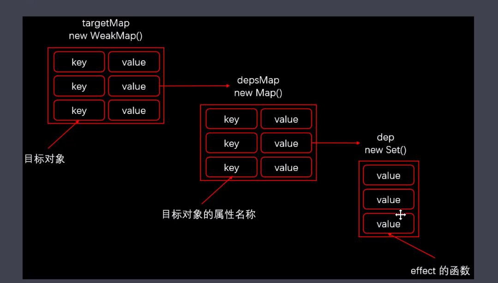

## Vue3:Vue.js 3.0 响应式系统的实现原理？
- 分别使用 `reactive`, `ref`, `toRefs`,`computed`去定义响应式的数据
- 其核心是`reactive`函数
- `reactive`函数内部实现过程
- - 定义 `get` 方法: 搜集依赖, 使用`Reflect.get`返回结果
- - 定义 `set` 方法: 触发更新, 返回`Reflect.set`的结果
- - 定义 `deleteProperty` 方法: 触发更新 返回`Reflect.deleteProperty`的结果

- 依赖搜集过程和触发更新的操作，如图
  

- `ref`内部调用 `reactive`方法
- `toRefs`内部也是使用了`reactive`的`getter`，代理对象的属性会自动搜集依赖
- `computed`内部执行了`ref`方法