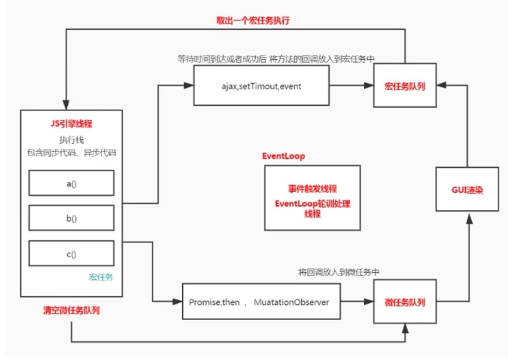

#### JS 异步编程的机制, EventLoop, 消息队列, 宏任务, 微任务?

- JS 异步编程

  JavaScript 语言的执行环境是单线程的, 一次只能执行一个任务, 多任务需要排队等候, 这种模式可能会阻塞代码, 导致代码执行效率低下. 为了避免这个问题, 出现了异步编程. 一般是通过 callback 回调函数, 事件发布/订阅, Promise 等来组织代码, 本质都是通过回调函数来实现异步代码的存放与执行. 

- EventLoop 事件环和消息队列

  **EventLoop** 是一种循环机制 , 不断去轮询一些队列 , 从中找到 需要执行的任务并按顺序执行的一个执行模型. 

  **消息队列** 是用来存放宏任务的队列,  比如定时器时间到了,  定时间内传入的方法引用会存到该队列,  ajax回调之后的执行方法也会存到该队列. 

  
  一开始整个脚本作为一个宏任务执行. 执行过程中同步代码直接执行, 宏任务等待时间到达或者成功后, 将方法的回调放入宏任务队列中, 微任务进入微任务队列. 

  当前主线程的宏任务执行完出队, 检查并清空微任务队列. 接着执行浏览器 UI 线程的渲染工作, 检查web worker 任务, 有则执行. 

  然后再取出一个宏任务执行. 以此循环...

  

- 宏任务与微任务

  **宏任务**可以理解为每次执行栈(Call Stack)执行的代码就是一个宏任务（包括每次从事件队列中获取一个事件回调并放到执行栈(Call Stack)中执行）. 

  浏览器为了让 JS 内部宏任务 与 DOM 操作能够有序的执行, 会在一个宏任务执行结束后, 在下一个宏任务执行开始前, 对页面进行重新渲染. 

  宏任务包含: script(整体代码), setTimeout, setInterval, I/O, UI交互事件, MessageChannel 等

  

  **微任务**可以理解是在当前任务执行结束后需要立即执行的任务. 也就是说, 在当前任务后, 在渲染之前, 执行清空微任务. 

  所以它的响应速度相比宏任务会更快, 因为无需等待 UI 渲染. 

  微任务包含: Promise.then, MutaionObserver, process.nextTick(Node.js 环境)等
