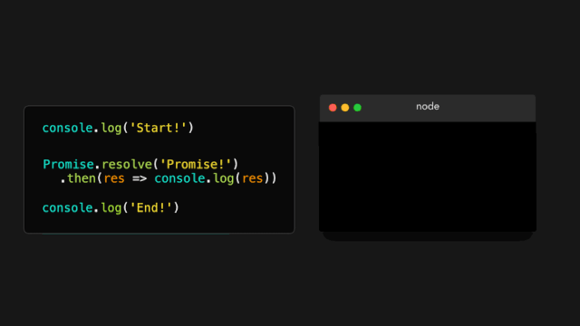
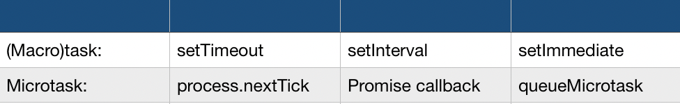
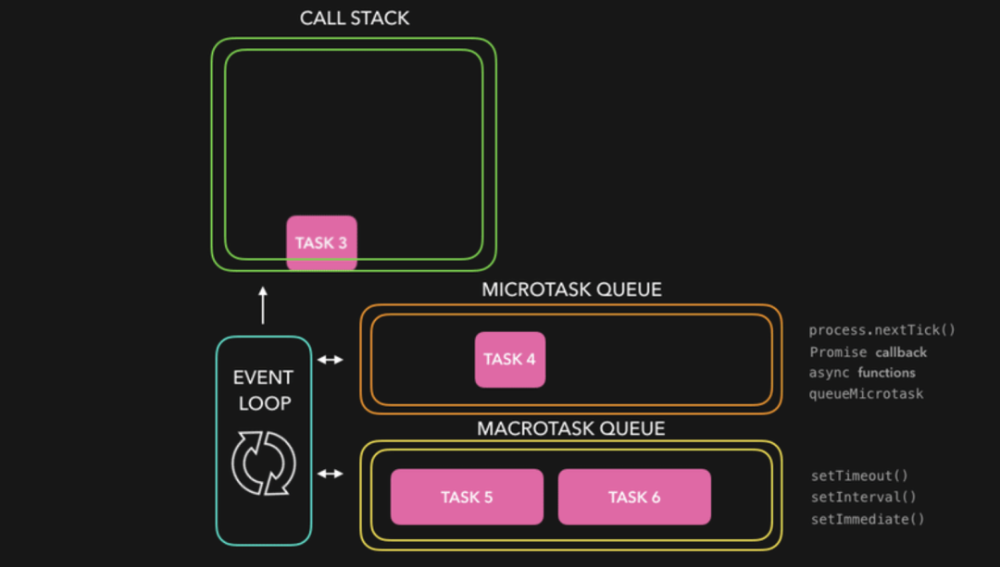
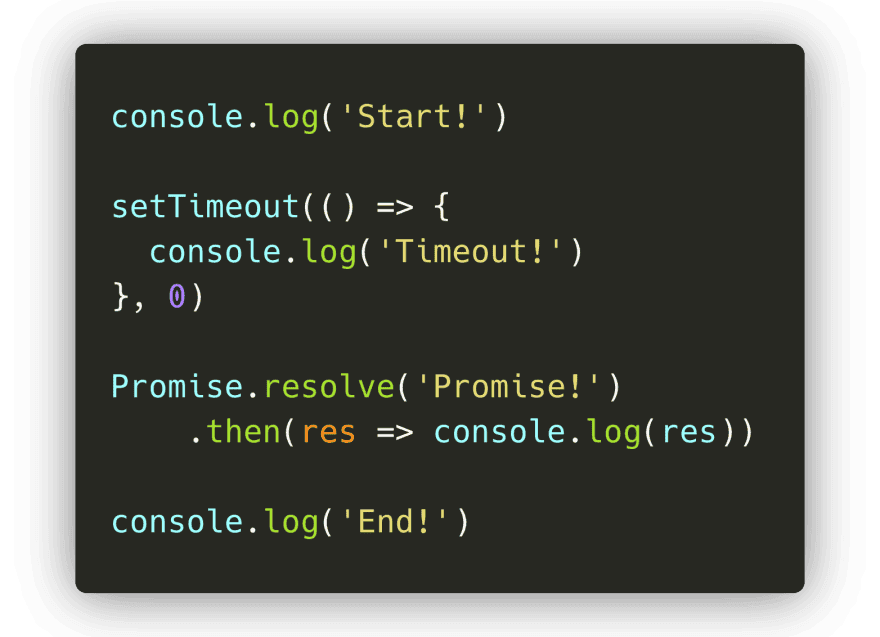
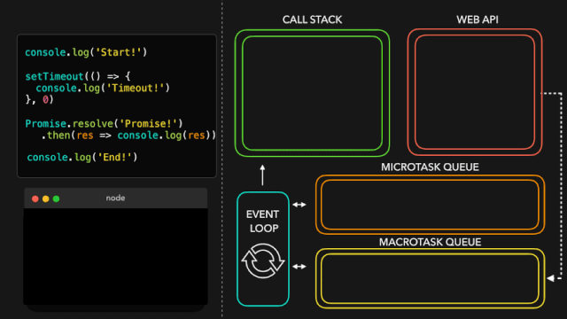
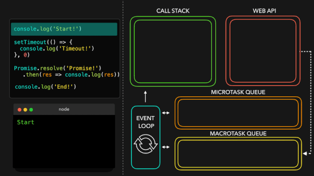
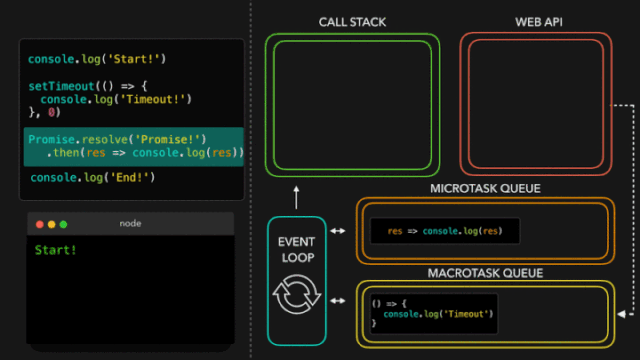
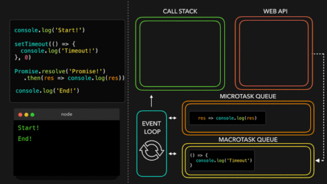
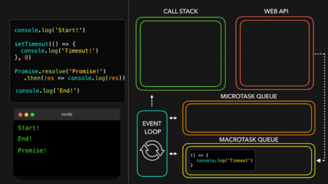

## 💛 宏任务和微任务
我们知道了一些如何创建 `promise` 以及如何提取出 `promise` 的值的方法.

让我们为脚本添加一些更多的代码并且再次运行它:

等下, 发生了什么?

首先, `Start`! 被输出.

好的, 我们已经看到了那一个即将到来的消息: `console.log('Start!')` 在最前一行输出! 

然而, 第二个被打印的值是 `End`!, 并不是 `promise` 被解决的值! 只有在 `End`! 被打印之后, `promise` 的值才会被打印.

这里发生了什么?

我们最终看到了 `promise` 真正的力量! 尽管 `JavaScript` 是单线程的, 我们可以使用 `Promise` 添加异步任务! 

等等, 我们之前没见过这种情况吗?

在 `JavaScript`  `Event Loop `中, 我们不是也可以使用浏览器原生的方法如 `setTimeout` 创建某类异步行为吗?

是的! 然而, 在事件循环内部, 实际上有 2 种类型的队列: 宏任务(`macro`)队列(或者只是叫做 任务队列 )和 微任务队列(`micro`).

那么什么是宏任务, 什么是微任务呢?

尽管他们比我在这里介绍的要多一些, 但是最常用的已经被展示在下面的表格中! 

我们看到 `Promise` 在微任务列表中! 当一个 `Promise` 解决 (`resolve`) 并且调用它的 `then()`、`catch()` 或 `finally()` 方法的时候, 这些方法里的回调函数被添加到微任务队列! 

这意味着 `then()`、`catch()` 或 `finally()`方法内的回调函数不是立即被执行, 本质上是为我们的 `JavaScript` 代码添加了一些异步行为! 

那么什么时候执行 `then()`、`catch()` 或 `finally()` 内的回调呢?

事件循环给与任务不同的优先级: 

1. 当前在调用栈 (`call stack`) 内的所有函数会被执行.当它们返回值的时候, 会被从栈内弹出.

2. 当调用栈是空的时, 所有排队的微任务会一个接一个从微任务任务队列中弹出进入调用栈中, 然后在调用栈中被执行! (微任务自己也能返回一个新的微任务, 有效地创建无限的微任务循环 )

3. 如果调用栈和微任务队列都是空的, 事件循环会检查宏任务队列里是否还有任务.如果宏任务中还有任务, 会从宏任务队列中弹出进入调用栈, 被执行后会从调用栈中弹出! 

让我们快速地看一个简单的例子: 

`Task1`: 立即被添加到调用栈中的函数, 比如在我们的代码中立即调用它.

`Task2`, `Task3`, `Task4`: 微任务, 比如 `promise` 中 `then` 方法里的回调, 或者用 `queueMicrotask` 添加的一个任务.

`Task5`, `Task6`: 宏任务, 比如 `setTimeout` 或者 `setImmediate` 里的回调

首先, `Task1` 返回一个值并且从调用栈中弹出.然后, `JavaScript` 引擎检查微任务队列中排队的任务.一旦微任务中所有的任务被放入调用栈并且最终被弹出, `JavaScript` 引擎会检查宏任务队列中的任务, 将他们弹入调用栈中并且在它们返回值的时候把它们弹出调用栈.

图中足够粉色的盒子是不同的任务, 让我们用一些真实的代码来使用它! 

在这段代码中我们有宏任务 `setTimeout` 和微任务 `promise` 的 `then` 回调.

一旦 `JavaScript` 引擎到达 `setTimeout` 函数所在的那行就会涉及到事件循环.

让我们一步一步地运行这段代码, 看看会得到什么样的日志! 

快速提一下: 在下边的例子中, 我正在展示的像 console.log, setTimeout 和 Promise.resolve 等方法正在被添加到调用栈中.它们是内部的方法实际上没有出现在堆栈痕迹中, 因此如果你正在使用调试器, 不用担心, 你不会在任何地方见到它们.它只是在没有添加一堆样本文件代码的情况下使这个概念解释起来更加简单.

在第一行, `JavaScript` 引擎遇到了 `console.log()` 方法, 它被添加到调用栈, 之后它在控制台输出值 `Start!`.`console.log` 函数从调用栈内弹出, 之后 `JavaScript` 引擎继续执行代码.

`JavaScript` 引擎遇到了 `setTimeout` 方法, 他被弹入调用栈中.`setTimeout` 是浏览器的原生方法: 它的回调函数 `(() => console.log('In timeout'))` 将会被添加到 `Web API`, 直到计时器完成计时.尽管我们为计时器提供的值是 0, 在它被添加到宏任务队列 (`setTimeout` 是一个宏任务) 之后回调还是会被首先推入 `Web API`.

`JavaScript` 引擎遇到了 `Promise.resolve` 方法.`Promise.resolve` 被添加到调用栈.在 `Promise` 解决 (`resolve`) 值之后, 它的 `then` 中的回调函数被添加到微任务队列.

`JavaScript` 引擎看到调用栈现在是空的.由于调用栈是空的, 它将会去检查在微任务队列中是否有在排队的任务! 是的, 有任务在排队, `promise` 的 `then` 中的回调函数正在等待轮到它! 它被弹入调用栈, 之后它输出了 `promise` 被解决后( `resolved` )的值: 在这个例子中的字符串 `Promise!`.

`JavaScript` 引擎看到调用栈是空的, 因此, 如果任务在排队的话, 它将会再次去检查微任务队列.此时, 微任务队列完全是空的.

到了去检查宏任务队列的时候了: `setTimeout` 回调仍然在那里等待! `setTimeout` 被弹入调用栈.回调函数返回 `console.log `方法, 输出了字符串 `In timeout!`.`setTimeout` 回调从调用栈中弹出.

终于, 所有的事情完成了! 看起来我们之前看到的输出最终并不是那么出乎意料.

