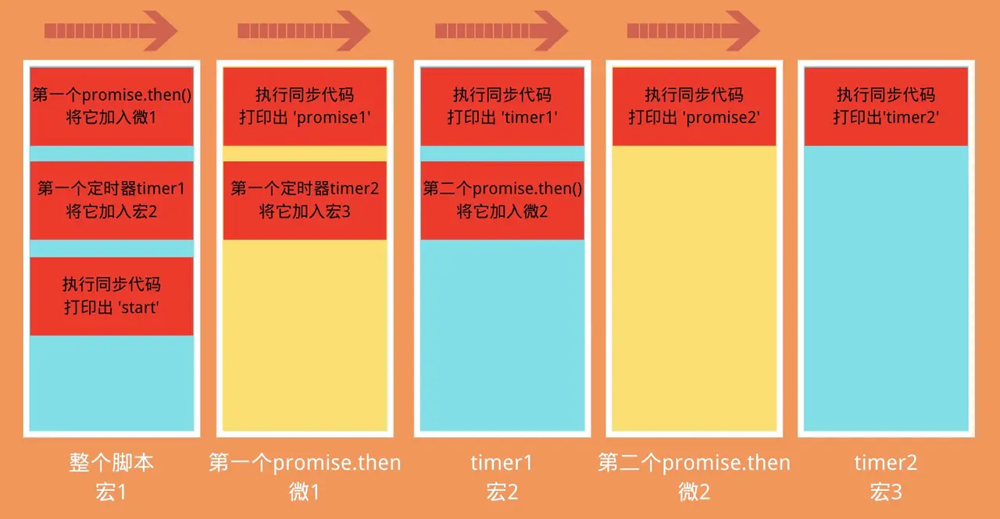

### Promise 题目 2 - 3 - 2

```js
Promise.resolve().then(() => {
  console.log('promise1')
  const timer2 = setTimeout(() => {
    console.log('timer2')
  }, 0)
})

const timer1 = setTimeout(() => {
  console.log('timer1')
  Promise.resolve().then(() => {
    console.log('promise2')
  })
}, 0)

console.log('start')

// start, promise1, timer1,promise2,timer2

```

### 过程分析
- 在 `promise` 中执行定时器, 又在定时器中执行 `promise`
- 并且要注意的是, 这里的 `Promise` 是直接 `resolve` 的, 而之前的 `new Promise` 不一样
1. 刚开始整个脚本作为第一次宏任务来执行, 我们将它标记为 `宏1`, 从上至下执行
2. 遇到 `Promise.resolve().then` 这个微任务, 将 `then` 中的内容加入第一次的微任务队列标记为 `微1`
3. 遇到定时器 `timer1`, 将它加入下一次宏任务的延迟列表, 标记为`宏2`, 等待执行(先不管里面是什么内容)
4. 执行`宏1`中的同步代码`start`
5. 第一次宏任务`(宏1)`执行完毕, 检查第一次的微任务队列`(微1)`, 发现有一个`promise.then`这个微任务需要执行
6. 执行打印出`微1`中同步代码`promise1`, 然后发现定时器`timer2`, 将它加入`宏2`的后面, 标记为`宏3`
7. 第一次微任务队列(`微1`)执行完毕, 执行第二次宏任务(`宏2`), 首先执行同步代码`timer1`
8. 然后遇到了`promise2`这个微任务, 将它加入此次循环的微任务队列, 标记为`微2`
9. `宏2`中没有同步代码可执行了, 查找本次循环的微任务队列(`微2`), 发现了`promise2`, 执行它
10. 第二轮执行完毕, 执行`宏3`, 打印出`timer2`


