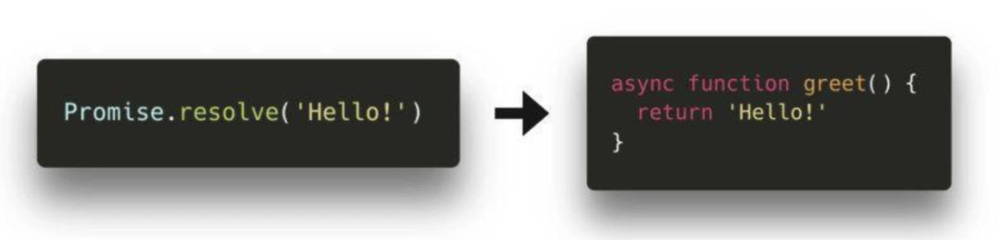
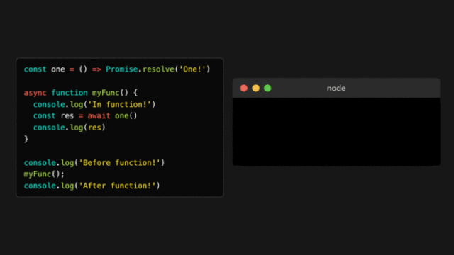
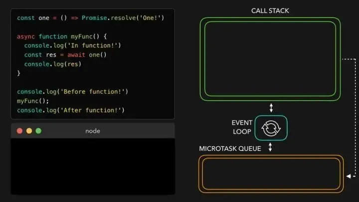
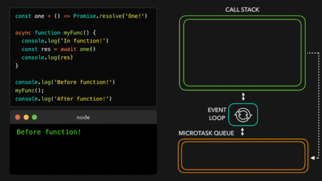
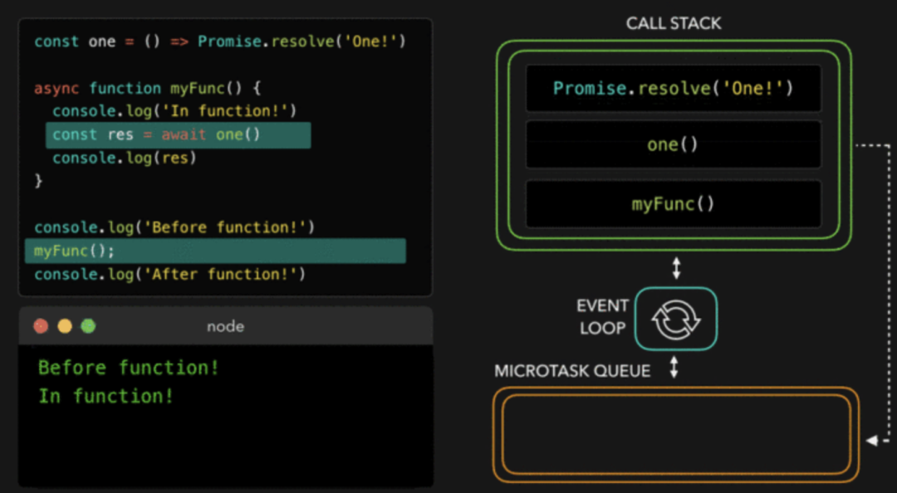
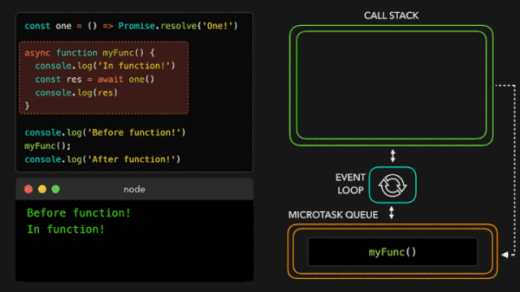
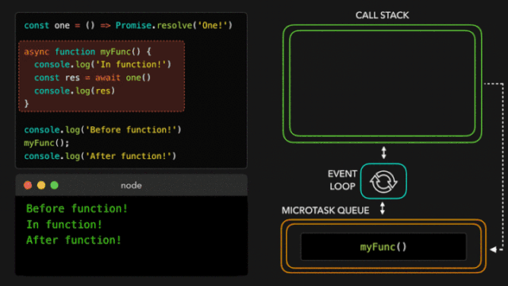

## 💛 Async / Await

ES7 引入了一个新的在 `JavaScript` 中添加异步行为的方式并且使 `promise` 用起来更加简单！随着 `async` 和 `await` 关键字的引入, 我们能够创建一个隐式的返回一个 `promise` 的 `async` 函数. 但是, 我们该怎么做呢? 

之前, 我们看到不管是通过输入 `new Promise(() => {})`, `Promise.resolve` 或 `Promise.reject`, 我们都可以显式的使用 `Promise` 对象创建 `promise`. 

我们现在能够创建隐式地返回一个对象的异步函数, 而不是显式地使用 `Promise` 对象！这意味着我们不再需要写任何 `Promise` 对象了. 

尽管 `async` 函数隐式的返回 `promise` 是一个非常棒的事实, 但是在使用 `await` 关键字的时候才能看到 `async` 函数的真正力量. 当我们等待 `await` 后的值返回一个 `resolved` 的 `promise` 时, 通过 `await` 关键字, 我们可以暂停异步函数. 如果我们想要得到这个 `resolved` 的 `promise` 的值, 就像我们之前用 `then` 回调那样, 我们可以为被 `await` 的 `promise` 的值赋值为变量！

这样, 我们就可以暂停一个异步函数吗? 很好, 但这到底是什么意思? 

当我们运行下面的代码块时让我们看下发生了什么: 

额, 这里发生了什么呢? 

首先, `JavaScript` 引擎遇到了 `console.log` . 它被弹入到调用栈中, 这之后 `Before function!`被输出. 

然后, 我们调用了异步函数 `myFunc()`, 这之后 `myFunc` 函数体运行. 函数主体内的最开始一行, 我们调用了另一个`console.log` , 这次传入的是字符串 `In function!`. `console.log` 被添加到调用栈中, 输出值, 然后从栈内弹出. 

函数体继续执行, 将我们带到第二行. 最终, 我们看到一个 `await` 关键字！

最先发生的事是被等待的值执行: 在这个例子中是 `函数one`. 它被弹入调用栈, 并且最终返回一个解决状态的 `promise`. `一旦Promise` 被解决并且 `one` 返回一个值, `JavaScript` 遇到了 `await` 关键字. 

当遇到 `await` 关键字的时候, 异步函数被暂停. 函数体的执行被暂停, `async` 函数中剩余的代码会在微任务中运行而不是一个常规任务！

现在, 因为遇到了 `await` 关键字, 异步函数 `myFunc` 被暂停, `JavaScript` 引擎跳出异步函数, 并且在异步函数被调用的执行上下文中继续执行代码: 在这个例子中是全局执行上下文!

最终, 没有更多的任务在全局执行上下文中运行！事件循环检查看看是否有任何的微任务在排队: 是的, 有！在解决了 `one` 的值以后, 异步函数 `myFunc` 开始排队. `myFunc` 被弹入调用栈中, 在它之前中断的地方继续运行. 

变量 `res` 最终获得了它的值, 也就是 `one` 返回的 `promise` 被解决的值！我们用 `res` 的值(在这个例子中是字符串`One!`)调用`console.log` . `One!`被打印到控制台并且`console.log` 从调用栈弹出. 

最终, 所有的事情都完成了！你注意到 `async` 函数相比于 `promise` 的 `then` 有什么不同吗? `await` 关键字暂停了`async函数`, 然而如果我们使用`then`的话, `Promise` 的主体将会继续被执行！

嗯, 这是相当多的信息！当使用 `Promise` 的时候, 如果你仍然感觉有一点不知所措, 完全不用担心. 我个人认为, `当使用异步JavaScript` 的时候, 只是需要经验去注意模式之后便会感到自信. 

当使用异步 `JavaScript` 的时候, 我希望你可能遇到的 “`无法预料的`” 或 “`不可预测的`” 行为现在变得更有意义.
